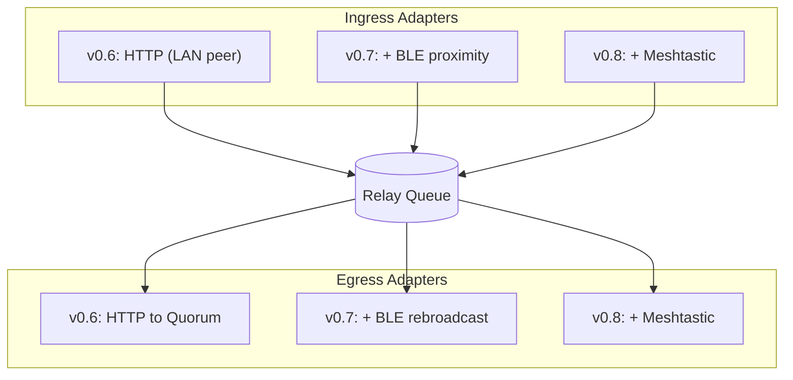
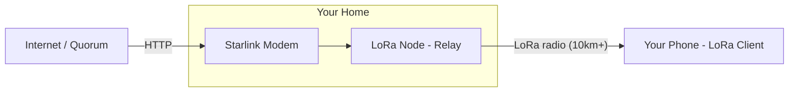

# Resilient Messenger Roadmap

**Current Version:** v0.3 (Tiered Delivery)  
**Target Version:** v1.0 (Production Ready)

---

## Vision

Build an outage-resilient, end-to-end encrypted messaging system that works when traditional infrastructure fails. Reme prioritizes resilience over convenience so people can communicate during network failures, infrastructure attacks, or censorship.

## Guiding principles

1. **Client-side resilience first**: Messages never disappear silently
2. **DTN tolerance**: No session state, independent message processing
3. **Transport agnostic**: Same encrypted payload across HTTP, BLE, mesh
4. **Cryptographic soundness**: Conservative primitives, defense in depth
5. **Privacy by design**: No IP leakage to DHTs, minimal metadata exposure

---

## Release timeline

```
v0.3 (Current) → v0.4        → [Postcard] → v0.5        → v0.6        → v0.7        → v0.8        → v1.0
Tiered           mDNS           Migration      Sneakernet     LAN            BLE            LoRa           Forward
Delivery         Discovery      (internal)     Export         Relay          Proximity      Mesh           Secrecy
```

---

## Current status (v0.3)

### Core foundation

| Component            | Status     |
|----------------------|------------|
| **Cryptography**     | ✅ Complete |
| **Wire Protocol**    | ✅ Complete |
| **DAG Ordering**     | ✅ Complete |
| **Tiered Delivery**  | ✅ Complete |
| **HTTP Transport**   | ✅ Complete |
| **MQTT Transport**   | ✅ Complete |
| **Outbox**           | ✅ Complete |
| **Storage**          | ✅ Complete |
| **TUI Client**       | ✅ Complete |
| **Node Server**      | ✅ Complete |
| **Embedded Relay**   | ✅ Complete |
| **Receipt Signing**  | ✅ Complete |

**Test coverage:** 385 tests across workspace, all passing.

---

## v0.4: LAN discovery

Automatic peer discovery and verified P2P messaging on local networks.

### mDNS/Bonjour discovery

**Problem:** Manual peer configuration is tedious for LAN scenarios.

**Solution:**
- Advertise client presence via mDNS (`_reme._tcp.local`)
- TXT records: `id=<routing_key>`, `port=<http_port>`
- Background scanning for discovered peers
- Automatic registration as Direct tier targets

**Deliverables:**
- [ ] `mdns` crate integration
- [ ] Service advertisement on client startup
- [ ] Background discovery task
- [ ] Automatic transport registration
- [ ] UI indication of discovered peers

### Node identity verification

**Problem:** mDNS discovers peers by IP, but we can't verify identity without pre-shared keys. DHCP reassignment could route messages to the wrong device.

**Solution:**
- Identity endpoint (`GET /api/v1/identity?challenge=<base64>`)
- Challenge-response protocol proves node controls claimed identity
- Background refresh detects IP reassignment (5 min default interval)
- Refresh on delivery failure or network change

**Deliverables:**
- [x] Identity endpoint on main node and embedded node
- [ ] Challenge-response verification in discovery flow
- [ ] Background identity refresh task
- [ ] Refresh triggers (periodic, failure, network change)
- [ ] Configuration options for refresh interval

**Success criteria:**
- Two clients on same LAN discover each other within 5 seconds
- Direct messages succeed without manual configuration
- Identity verification prevents messages to wrong device after DHCP change
- Handles network changes without crashing

---

## Internal: Postcard migration (Pre-v0.5)

Simplify serialization code and prepare for stable wire format.

### Migrate from Bincode to Postcard

**Problem:** Current bincode encoding requires manual `impl Encode/Decode` blocks, is Rust-specific, and has limited schema evolution capabilities. This creates maintenance burden and will complicate future cross-platform clients.

**Why now (before v0.5):**
- Sneakernet archive format should use the final encoding approach
- BLE/LoRa transports will build on this foundation
- Cleaner codebase for constrained transport development
- Still at PoC stage (version 0.0) with no deployed clients to break

**Why Postcard:**
| Feature | Bincode | Postcard |
|---------|---------|----------|
| Derive macros | `Encode, Decode` (bincode-specific) | `Serialize, Deserialize` (serde) |
| Manual impls | Required for custom types | Standard serde patterns |
| Wire format spec | Undocumented | [Documented](https://postcard.jamesmunns.com) |
| Size | Compact | Similar (varint encoding) |
| no_std support | Yes | Yes (designed for embedded) |
| Cross-language | Rust only | Serde ecosystem + spec |

**Deliverables:**
- [ ] Replace `bincode` with `postcard` in all crates
- [ ] Convert `#[derive(Encode, Decode)]` to `#[derive(Serialize, Deserialize)]`
- [ ] Remove manual `impl Encode/Decode` blocks (use serde attributes)
- [ ] Bump wire format version to 0.1
- [ ] Update CLAUDE.md and WHITEPAPER.md references
- [ ] Verify message sizes remain within LoRa MTU budget

**Success criteria:**
- All 385+ tests pass
- Wire format size delta < 5%
- No manual serialization impl blocks remaining

**Future:** Postcard learnings will help with v1.0 Protobuf design for cross-language schema with full backward/forward compatibility.

---

## v0.5: Sneakernet export

Air-gapped messaging via file transfer.

### Message archive export/import

**Problem:** Sometimes there's no network at all, not even BLE range. Need a way to physically transport encrypted messages between air-gapped systems.

**Solution:**
- Export pending outbox messages to encrypted archive file
- Import received archives and process as normal messages
- QR code generation for small messages (single text messages)
- Archive format reusable by future transports (BLE, LoRa)

**Deliverables:**
- [ ] Archive format specification (versioned, extensible)
- [ ] Export command in CLI (`reme export --to alice --file msg.reme`)
- [ ] Import command in CLI (`reme import msg.reme`)
- [ ] QR code generation for single messages
- [ ] QR code scanning (camera or image file)
- [ ] TUI integration for export/import flows

**Success criteria:**
- Round-trip export→USB→import works correctly
- QR codes work for messages up to ~500 bytes
- Archive format documented for interoperability
- No data loss or corruption in transfer

**What this enables:**

Send encrypted messages across an air gap: USB drive, printed QR code, or carrier pigeon. The simplest possible offline transport, and foundation for all others.

---

## v0.6: LAN relay

Route messages through LAN peers during partial Internet outages.

### Store-and-forward relay queue

v0.6 introduces the **relay queue**, a store-and-forward component that v0.7 and v0.8 reuse with additional ingress paths.



Encrypted envelopes only, no decryption needed. Queue is persistent and survives restarts.

The queue only handles encrypted `OuterEnvelope` blobs. Relay nodes never decrypt; they move bytes between ingress and egress.

### Peer relay mode

**Problem:** During partial outages, some LAN peers have Internet access and others don't. Peers without Internet should be able to relay through peers that do.

**Solution:**
- Discovered peers act as relays for messages to external recipients
- No identity verification needed for relay (E2E encrypted, same trust model as Quorum)
- Opt-in configuration for both accepting and using relay requests
- Relay capability advertised in mDNS TXT records

**Deliverables:**
- [ ] Relay queue with persistent storage and retry logic
- [ ] HTTP ingress adapter (accepts envelopes from LAN peers)
- [ ] HTTP egress adapter (forwards to Quorum nodes)
- [ ] Relay capability advertisement in mDNS TXT records
- [ ] Relay accept/use configuration options
- [ ] Relay routing in transport coordinator
- [ ] Relay status in TUI (showing relay path)

**Success criteria:**
- Alice (no Internet) sends to Charlie (external) via Bob (has Internet)
- Message delivered when Bob reconnects to Internet
- Relay path visible in delivery status
- Works transparently with existing outbox retry logic

Your message reaches the outside world through any peer that has connectivity, even if you don't.

---

## v0.7: BLE proximity

Direct device-to-device messaging with no infrastructure.

### BLE proximity exchange

**Problem:** Internet-based transports fail during infrastructure outages or censorship. Need a transport that works with zero infrastructure and doesn't leak metadata to third parties.

**Solution:**
- BLE GATT server advertising routing key
- Scan for nearby peers
- Exchange envelopes over BLE characteristics
- Store-and-forward when peers pass each other
- Detached messages (no DAG overhead) for constrained payloads

**Deliverables:**
- [ ] `btleplug` integration
- [ ] GATT service definition
- [ ] BLE message exchange protocol
- [ ] Detached message support
- [ ] Background scanning/advertising
- [ ] Power-efficient operation

### BLE relay (ingress + egress)

BLE works as both an ingress and egress adapter for the v0.6 relay queue:

- **Ingress**: A phone with BLE + Internet receives envelopes via BLE and forwards them to Quorum over HTTP.
- **Egress**: A device with queued messages rebroadcasts them over BLE to nearby peers. Peers that overhear the broadcast can relay further (BLE-to-BLE) or bridge to Quorum (BLE-to-HTTP).

**RSSI-based relay timing**: To avoid flooding, nodes use received signal strength to schedule rebroadcast delays. Nodes with weaker RSSI (farther from the original sender) rebroadcast first; nodes with stronger RSSI (closer, more likely to have already received it) wait longer and cancel if they overhear a duplicate. This is the same approach Meshtastic uses for LoRa mesh flooding.

**Deliverables:**
- [ ] BLE ingress adapter for relay queue
- [ ] BLE egress adapter with RSSI-based relay timing
- [ ] Relay capability advertisement in BLE service data
- [ ] Duplicate suppression (heard-before cancellation)

**Success criteria:**
- Alice (BLE only) → Bob's phone (BLE + Internet) → Quorum → Charlie
- BLE-to-BLE relay extends range beyond single-hop BLE distance
- Same relay status/tracking as LAN relay

### Transport-layer chunking

**Problem:** BLE MTU (20-512 bytes) may be smaller than OuterEnvelope (~200+ bytes). Need to split messages for constrained transports without re-encryption.

Chunking happens at the transport layer, not application layer. Relay nodes can split/reassemble encrypted blobs without having decryption keys.

**Solution:** A `TransportChunk` header wraps byte-split fragments of an OuterEnvelope. No encryption, just splitting.

| Field | Size | Description |
|-------|------|-------------|
| envelope_hash | 8 bytes | Links chunks belonging to the same envelope |
| chunk_index | 1 byte | Position (0, 1, 2...) |
| chunk_total | 1 byte | Total chunk count |
| payload | variable | Raw bytes of the OuterEnvelope fragment |

**Properties:**
- Any node can split/reassemble (no keys needed)
- Original E2E encryption preserved
- Enables the "Starlink Relay" scenario (see v0.8)

**Deliverables:**
- [ ] `TransportChunk` wire format
- [ ] BLE chunking/reassembly in transport layer
- [ ] Reassembly buffer with timeout and LRU eviction
- [ ] Chunk deduplication

**Success criteria:**
- Message exchange succeeds without Internet
- <30 second exchange time for nearby peers
- Works on Linux/macOS/Windows/Android
- Messages larger than BLE MTU transfer correctly

---

## v0.8: LoRa mesh

Kilometers-range messaging without Internet.

### LoRa transport: two modes

**Problem:** BLE requires physical proximity (~10m). For disaster response, remote areas, or censorship resistance, we need communication over kilometers without any Internet infrastructure.

There are two distinct approaches, depending on whether a Meshtastic network is available:

**Mode 1: Meshtastic bridge (preferred)**

When a Meshtastic mesh exists, reme treats it as an opaque transport. Meshtastic handles all mesh routing, hop counts, and duty cycle management. Reme just sends and receives chunked OuterEnvelopes over the Meshtastic serial/BLE API.

- Reme does **not** relay LoRa-to-LoRa itself; Meshtastic does that
- Reme **does** bridge Meshtastic ↔ other transports (HTTP, BLE) via the relay queue
- Any Meshtastic user running reme bridge software can contribute relay capacity. No trust required, they only see encrypted bytes.

**Mode 2: Plain LoRa (no Meshtastic)**

Without Meshtastic, reme would need its own LoRa mesh relay protocol. This is significantly more work (duty cycle management, hop limiting, routing tables) and is deferred unless there's a concrete need. Meshtastic already solves this well.

**Deliverables:**
- [ ] Meshtastic serial/BLE protocol integration
- [ ] Meshtastic transport adapter (send/receive chunked envelopes)
- [ ] Transport-layer chunking for LoRa MTU (~200 bytes, reuses v0.7 TransportChunk)
- [ ] Detached messages by default (minimize overhead)
- [ ] Automatic reassembly on receive
- [ ] Integration with existing transport coordinator

### Meshtastic relay (ingress + egress)

Meshtastic acts as both ingress and egress for the v0.6 relay queue, same as BLE:

- **Ingress**: Meshtastic-received envelopes are deposited into the relay queue for forwarding to Quorum over HTTP.
- **Egress**: Envelopes fetched from Quorum (or received via other transports) are sent out over Meshtastic for off-grid recipients.

Works on dedicated relay nodes (Raspberry Pi + Meshtastic) or phones with the Meshtastic app.

**Deliverables:**
- [ ] Meshtastic ingress adapter for relay queue
- [ ] Meshtastic egress adapter for relay queue
- [ ] Headless relay mode (no TUI, minimal resources)
- [ ] Relay statistics/monitoring endpoint

**Success criteria:**
- A stranger's Meshtastic node bridges your message to Quorum
- Works without any prior relationship or key exchange

### The "Starlink Relay" scenario

You're off-grid across the city during a power outage. Your home has Starlink + a stationary LoRa node. Messages arrive for you via Internet, but you have no Internet access.

The home relay node fetches messages from Quorum (HTTP ingress), then re-broadcasts them over LoRa (LoRa egress) without decrypting them. This is the reverse direction of normal relay, which means v0.8 needs to add LoRa as an **egress** adapter to the v0.6 relay queue.



**How it works:**
1. Home node fetches messages from Quorum (HTTP) for your `routing_key`
2. Node **cannot decrypt** (doesn't have your private key)
3. Node uses transport-layer chunking to split OuterEnvelope for LoRa MTU
4. Broadcasts chunks over LoRa mesh
5. Your off-grid device receives chunks, reassembles, decrypts

**What this enables:**

Message someone kilometers away without Internet, cell towers, or any infrastructure. Just radio waves.

Your home relay bridges Internet and radio so you receive messages off-grid without anyone decrypting them.

This is what separates reme from conventional messengers.

**Community relay network:**
The same scenario works with **any** Internet-connected Meshtastic node running reme bridge software, not just your own. A neighbor's node, a community relay on a hilltop, or a stranger's device can all bridge your messages between Meshtastic and the Internet. Zero trust required (E2E encryption), zero coordination required (just run the bridge daemon).

**Success criteria:**
- Message delivery over 5+ km via Meshtastic mesh
- Meshtastic handles multi-hop routing (reme does not relay LoRa-to-LoRa)
- Starlink relay scenario works (HTTP → Meshtastic egress without decryption)
- Third-party bridge nodes work without prior trust/coordination
- Works with off-the-shelf Meshtastic hardware (T-Beam, Heltec, etc.)

---

## v1.0: Forward secrecy (breaking release)

Production-ready with session-based forward secrecy and stable wire format.

> **Breaking changes:** v1.0 is the last planned breaking release. Wire format migrates from Postcard to Protobuf for cross-language compatibility and long-term schema evolution. All pre-1.0 clients will be incompatible.

### Wire format: Protobuf migration

**Why Protobuf for v1.0:**
- Cross-language code generation (mobile apps, web clients)
- Field numbers enable backward/forward compatible schema evolution
- Unknown field preservation (old clients pass through new fields)
- Industry standard with good tooling
- `.proto` files are the canonical protocol specification

**Postcard → Protobuf learnings:**
- Size budgets validated on constrained transports (LoRa, BLE)
- Field ordering and optionality patterns established
- Schema evolution needs identified from v0.x development

### Protocol: Async Noise XX handshake

Implements DTN-safe forward secrecy without prekey servers.

### Features

#### 1. Encrypted sender in OuterEnvelope

**Problem:** Recipient can't identify sender when session keys lost.

**Solution:**
- `encrypted_sender: [u8; 48]` in OuterEnvelope
- Always decryptable by recipient MIK
- Enables key-loss recovery

#### 2. Sign-all-bytes

**Problem:** Static field signatures break on version upgrades.

**Solution:**
- Sign all serialized InnerEnvelope bytes
- Forward/backward compatible

#### 3. Noise XX handshake

**Problem:** MIK-only lacks forward secrecy.

**Solution:**
- Mutual authentication with ephemeral DH
- Either party can initiate
- Epoch-based replay protection
- MIK fallback when session unavailable

#### 4. DAG-integrated key lifecycle

**Problem:** When to delete old session keys?

**Solution:**
- Delete key only after all messages acknowledged via DAG
- Conservative retention during gaps
- Bounded memory (max 10 retained keys)

#### 5. Key loss recovery

**Problem:** Recipient loses session keys.

**Solution:**
- Decrypt `encrypted_sender` to identify peer
- Request re-send with MIK encryption
- Automatic without manual intervention

---

## Future considerations (post-v1.0)

### Group messaging
- Sender Keys protocol (O(1) encryption)
- Multi-sender DAG with per-member gap detection
- Admin operations (add/remove/promote)

### Additional transports
- Satellite uplinks
- Ham radio digital modes

### Better privacy
- Fixed-size message padding
- Cover traffic
- Routing key rotation

### State synchronization
- Merkle accumulator sync
- Cross-device state merge

### Security improvements
- Post-quantum cryptography (Kyber)
- Hardware security module support

---

## Rejected approaches

### Iroh/QUIC P2P via DHT

**Status:** Rejected due to privacy concerns

**Problem:** Iroh's DHT-based peer discovery leaks IP addresses to anyone querying the DHT. This conflicts with reme's privacy-by-design principle.

**Alternatives considered:**
- Private DHT with authenticated peers only
- Direct connections via known addresses (no discovery)
- Tor-based discovery

**Decision:** Focus on BLE for zero-infrastructure scenarios. For Internet-based P2P, users can configure direct connections to known peers without DHT discovery.

---

## Success metrics

### v0.4
- <5s peer discovery on LAN
- Zero configuration for LAN messaging
- Identity verification prevents wrong-device delivery

### Postcard migration
- All tests pass with new serialization
- Wire format size delta < 5%
- No manual serialization impl blocks

### v0.5
- Successful export→transfer→import round-trip
- QR codes for small messages
- Archive format documented

### v0.6
- LAN relay works during partial Internet outages
- Relay path visible in delivery status

### v0.7
- BLE exchange <30s proximity time
- BLE relay extends range via RSSI-based rebroadcast
- Works without any Internet connectivity

### v0.8
- Message delivery over 5+ km via Meshtastic mesh
- Meshtastic bridge works (reme does not relay LoRa-to-LoRa)
- Works with off-the-shelf Meshtastic hardware

### v1.0
- Protobuf wire format (breaking change)
- Session-based forward secrecy
- Automatic key-loss recovery
- Production-ready security audit
- Mobile apps (Android/iOS)

---

## Development process

### Testing requirements

1. **Unit tests**: Core logic in isolation
2. **Integration tests**: Multi-transport, multi-node scenarios
3. **Property tests**: Invariants (no message loss, no duplicates)
4. **Security review**: Crypto changes require peer review

### Quality gates

| Gate              | Requirement                                   |
|-------------------|-----------------------------------------------|
| **Code review**   | All PRs require review                        |
| **CI passing**    | Tests, clippy, rustfmt                        |
| **Documentation** | Updated CLAUDE.md, WHITEPAPER.md, inline docs |
| **Changelog**     | User-facing changes documented                |

---

## Contributing

Features prioritized by:
1. **Impact**: How many use cases does it enable?
2. **Privacy**: Does it leak metadata or require third-party infrastructure?
3. **Dependencies**: What must be done first?

Security/resilience features have priority over convenience features.
