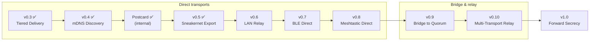
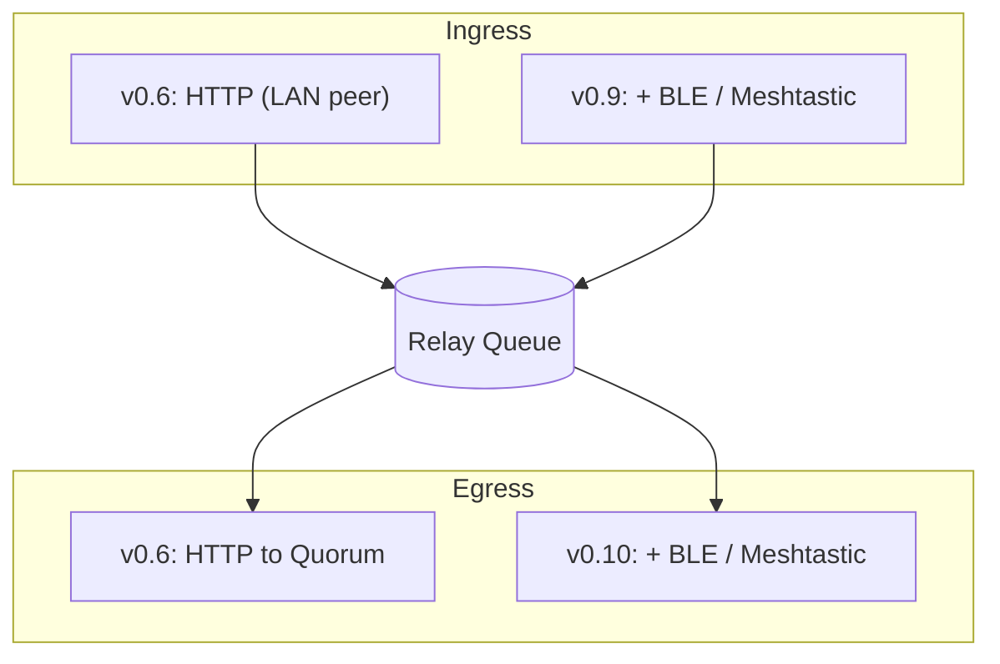
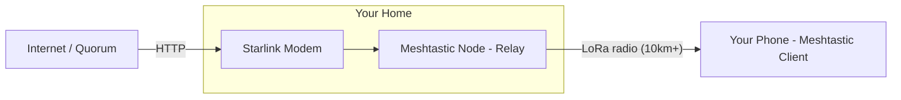

# Resilient Messenger Roadmap

**Current Version:** v0.5 (Sneakernet Export)
**Target Version:** v1.0 (Production Ready)

---

## Vision

Build an outage-resilient, end-to-end encrypted messaging system that works when traditional infrastructure fails. Reme prioritizes resilience over convenience so people can communicate during network failures, infrastructure attacks, or censorship.

## Guiding principles

1. **Client-side resilience first**: Messages never disappear silently
2. **DTN tolerance**: No session state, independent message processing
3. **Transport agnostic**: Same encrypted payload across HTTP, BLE, LoRa
4. **Cryptographic soundness**: Conservative primitives, defense in depth
5. **Privacy by design**: No IP leakage to DHTs, minimal metadata exposure

---

## Release timeline

---

## Current status (v0.5)

### Core foundation

| Component            | Status     |
|----------------------|------------|
| **Cryptography**     | ✅ Complete |
| **Wire Protocol**    | ✅ Complete (postcard) |
| **DAG Ordering**     | ✅ Complete (persisted) |
| **Tiered Delivery**  | ✅ Complete |
| **HTTP Transport**   | ✅ Complete |
| **MQTT Transport**   | ✅ Complete |
| **Outbox**           | ✅ Complete |
| **Storage**          | ✅ Complete |
| **TUI Client**       | ✅ Complete |
| **Node Server**      | ✅ Complete |
| **Embedded Relay**   | ✅ Complete |
| **Receipt Signing**  | ✅ Complete |
| **LAN Discovery**    | ✅ Complete |
| **Identity Verification** | ✅ Complete |
| **Bundle Format**    | ✅ Complete (reme-bundle crate) |
| **Sneakernet Export/Import** | ✅ Complete (client + node) |
| **CLI Subcommands**  | ✅ Complete (client + node) |

**Test coverage:** 670 tests across workspace, all passing.

---

## v0.4: LAN discovery

Automatic peer discovery and verified P2P messaging on local networks.

### mDNS/Bonjour discovery

**Problem:** Manual peer configuration is tedious for LAN scenarios.

**Solution:**
- Advertise client presence via mDNS (`_reme._tcp.local`)
- TXT records: `id=<routing_key>`, `port=<http_port>`
- Background scanning for discovered peers
- Automatic registration as Direct tier targets

**Deliverables:**
- [x] `mdns` crate integration (`mdns-sd`)
- [x] Service advertisement on client startup
- [x] Background discovery task
- [x] Automatic transport registration
- [x] UI indication of discovered peers (LAN peer count in status bar)

### Node identity verification

**Problem:** mDNS discovers peers by IP, but we can't verify identity without pre-shared keys. DHCP reassignment could route messages to the wrong device.

**Solution:**
- Identity endpoint (`GET /api/v1/identity?challenge=<base64>`)
- Challenge-response protocol proves node controls claimed identity
- Background refresh detects IP reassignment (5 min default interval)
- Refresh on delivery failure or network change

**Deliverables:**
- [x] Identity endpoint on main node and embedded node
- [x] Challenge-response verification in discovery flow
- [x] Background identity refresh task
- [x] Refresh triggers (periodic, failure-based circuit breaker)
- [ ] Refresh trigger: network change detection (deferred — periodic concurrent refresh covers this)
- [x] Configuration options for refresh interval (`refresh_interval_secs`)

**Success criteria:**
- Two clients on same LAN discover each other within 5 seconds
- Direct messages succeed without manual configuration
- Identity verification prevents messages to wrong device after DHCP change
- Handles network changes without crashing

---

## Internal: Postcard migration (Pre-v0.5) ✅

Simplify serialization code and prepare for stable wire format.

### Migrate from Bincode to Postcard

**Problem:** Current bincode encoding requires manual `impl Encode/Decode` blocks, is Rust-specific, and has limited schema evolution capabilities. This creates maintenance burden and will complicate future cross-platform clients.

**Why now (before v0.5):**
- Sneakernet archive format should use the final encoding approach
- BLE/LoRa transports will build on this foundation
- Cleaner codebase for constrained transport development
- Still at PoC stage (version 0.0) with no deployed clients to break

**Why Postcard:**
| Feature | Bincode | Postcard |
|---------|---------|----------|
| Derive macros | `Encode, Decode` (bincode-specific) | `Serialize, Deserialize` (serde) |
| Manual impls | Required for custom types | Standard serde patterns |
| Wire format spec | Undocumented | [Documented](https://postcard.jamesmunns.com) |
| Size | Compact | Similar (varint encoding) |
| no_std support | Yes | Yes (designed for embedded) |
| Cross-language | Rust only | Serde ecosystem + spec |

**Deliverables:**
- [x] Replace `bincode` with `postcard` in all crates
- [x] Convert `#[derive(Encode, Decode)]` to `#[derive(Serialize, Deserialize)]`
- [x] Remove manual `impl Encode/Decode` blocks (use serde attributes)
- [x] Quarantine corrupt mailbox rows instead of deleting (SEC-L11)
- [x] Make all encode paths return `Result` (BUG-M1/M2/M4)
- [x] Add fuzz harnesses for wire format parsing
- [ ] Bump wire format version to 0.1 (deferred — PoC phase, no deployed clients)
- [ ] Verify message sizes remain within LoRa MTU budget

**Success criteria:**
- All 614+ tests pass
- Wire format size delta < 5%
- No manual serialization impl blocks remaining

**Future:** Postcard learnings will help with v1.0 Protobuf design for cross-language schema with full backward/forward compatibility.

---

## v0.5: Sneakernet export ✅

Air-gapped messaging via file transfer.

### Message archive export/import

**Problem:** Sometimes there's no network at all, not even BLE range. Need a way to physically transport encrypted messages between air-gapped systems.

**Solution:**
- Export pending outbox messages to `.reme` bundle file
- Import received bundles and process as normal messages
- Bundle format: versioned header, length-prefixed WirePayload frames, BLAKE3 checksum
- Archive format reusable by future transports (BLE, LoRa)

**Deliverables:**
- [x] `reme-bundle` crate — archive format implementation (PR #181)
- [x] Client CLI subcommands — `reme tui`, `reme export`, `reme import` (PR #185)
- [x] Client export — offline outbox export with `--to`, `--since`, `--limit`, `--force`, `--include-sent` (PR #189)
- [x] Client import — decrypt and store self-addressed messages, idempotent (PR #190)
- [x] Shared identity module — extracted from TUI for CLI reuse (PR #190)
- [x] Node CLI subcommands — `reme-node serve`, `reme-node export`, `reme-node import` (PR #191)
- [x] Node export/import — opaque envelope storage, tombstone processing (PR #191)
- [x] Sneakernet round-trip integration tests — 7 tests covering full workflow (PR #201)
- [ ] Archive format specification document — deferred (format not yet finalized)

**Deferred:**
- QR code generation/scanning — requires native app with camera access
- TUI integration for export/import flows — CLI commands sufficient for now

**Success criteria:**
- ✅ Round-trip export→USB→import works correctly
- QR codes — deferred to native apps
- Archive format documentation — pending format finalization
- ✅ No data loss or corruption in transfer (verified by integration tests)

**What this enables:**

Send encrypted messages across an air gap: USB drive or carrier pigeon. The simplest possible offline transport, and foundation for all others.

---

## v0.6: LAN relay

Route messages through LAN peers during partial Internet outages.

### Store-and-forward relay queue

v0.6 introduces the **relay queue**, a store-and-forward component that later versions extend with additional adapters.

Encrypted envelopes only, no decryption needed. Queue is persistent and survives restarts.

The queue only handles encrypted `OuterEnvelope` blobs. Relay nodes never decrypt; they move bytes between ingress and egress.

### Peer relay mode

**Problem:** During partial outages, some LAN peers have Internet access and others don't. Peers without Internet should be able to relay through peers that do.

**Solution:**
- Discovered peers can act as **untrusted best-effort relays** for messages to external recipients
- Contact-style identity verification is not required for submit/store relay, but anonymous discovered relays are **not** equivalent to configured Quorum peers
- Opt-in configuration for both accepting and using relay requests
- Relay capability advertised in mDNS TXT records

**Deliverables:**
- [ ] Relay queue with persistent storage and retry logic
- [ ] HTTP ingress adapter (accepts envelopes from LAN peers)
- [ ] HTTP egress adapter (forwards to Quorum nodes)
- [ ] Discovered-peer capability policy (submit/store only, no quorum credit, no replication, no exact-key fetch)
- [ ] Relay capability advertisement in mDNS TXT records
- [ ] Relay accept/use configuration options
- [ ] Relay routing in transport coordinator
- [ ] Relay status in TUI (showing relay path)

**Success criteria:**
- Alice (no Internet) sends to Charlie (external) via Bob (has Internet)
- Message delivered when Bob reconnects to Internet
- Relay path visible in delivery status
- Works transparently with existing outbox retry logic

Your message reaches the outside world through any peer that has connectivity, even if you don't.

---

## v0.7: BLE direct

Point-to-point encrypted messaging over BLE. Two devices in proximity exchange messages directly, no Internet or infrastructure needed.

### BLE proximity exchange

**Problem:** Internet-based transports fail during infrastructure outages or censorship. Need a transport that works with zero infrastructure.

**Solution:**
- BLE GATT server advertising routing key
- Scan for nearby peers, exchange envelopes over BLE characteristics
- Detached messages (no DAG overhead) for constrained payloads

### Transport-layer chunking

BLE MTU (20-512 bytes) may be smaller than an OuterEnvelope (~200+ bytes). Chunking splits envelopes at the transport layer without re-encryption. Any node can split/reassemble (no keys needed).

| Field | Size | Description |
|-------|------|-------------|
| envelope_hash | 8 bytes | Links chunks belonging to the same envelope |
| chunk_index | 1 byte | Position (0, 1, 2...) |
| chunk_total | 1 byte | Total chunk count |
| payload | variable | Raw bytes of the OuterEnvelope fragment |

Reused by Meshtastic transport in v0.8.

**Deliverables:**
- [ ] `btleplug` integration
- [ ] GATT service definition
- [ ] BLE message exchange protocol
- [ ] `TransportChunk` wire format with chunking/reassembly
- [ ] Reassembly buffer with timeout and LRU eviction
- [ ] Detached message support
- [ ] Background scanning/advertising

**Success criteria:**
- Alice and Bob exchange messages over BLE with no Internet
- <30 second exchange time for nearby peers
- Messages larger than BLE MTU transfer correctly via chunking
- Works on Linux/macOS/Windows/Android

---

## v0.8: Meshtastic direct

Point-to-point encrypted messaging over LoRa via Meshtastic. Two devices with Meshtastic hardware exchange messages directly, no Internet needed. Meshtastic handles LoRa radio management; reme treats it as an opaque transport.

### Meshtastic transport

**Problem:** BLE requires physical proximity (~10m). For disaster response, remote areas, or censorship resistance, we need communication over kilometers without any Internet infrastructure.

**Solution:** Integrate with Meshtastic via its serial/BLE API. Reme sends and receives chunked OuterEnvelopes; Meshtastic handles duty cycle, hop counts, and mesh routing.

Reme does **not** implement its own LoRa mesh protocol. Meshtastic already solves this. Plain LoRa (without Meshtastic) is deferred unless there's a concrete need.

**Deliverables:**
- [ ] Meshtastic serial/BLE protocol integration
- [ ] Meshtastic transport adapter (send/receive chunked envelopes)
- [ ] Reuse v0.7 TransportChunk for LoRa MTU (~200 bytes)
- [ ] Detached messages by default (minimize overhead)
- [ ] Integration with existing transport coordinator

**Constraints:**
- Regulatory duty cycle limits (e.g., 1% at EU 868 MHz) mean multi-chunk messages may take several minutes to transmit. LoRa messaging is practical for short texts with minutes of latency, not real-time conversation.

**Success criteria:**
- Alice and Bob exchange messages over Meshtastic in direct line of sight
- Message delivery over 5+ km with line-of-sight
- Works with off-the-shelf Meshtastic hardware (T-Beam, Heltec, etc.)

---

## v0.9: Bridge to Quorum

Devices that receive envelopes via BLE or Meshtastic can bridge them to Quorum via the v0.6 relay queue.

BLE bridging works the same way as LAN HTTP relay: the BLE peer is an ephemeral target, envelopes enter the relay queue, and the node's TransportCoordinator delivers via its available tiers (Direct, Quorum, BestEffort). No special "BLE ingress adapter" needed — the relay queue already accepts envelopes from any transport.

Meshtastic bridging requires a Meshtastic-specific ingress adapter since envelopes arrive chunked via the Meshtastic serial/BLE API and need reassembly before entering the relay queue.

### Ingress adapters

**Deliverables:**
- [ ] Meshtastic ingress adapter (reassemble chunked envelopes → relay queue)
- [ ] Relay capability advertisement in BLE service data

**Success criteria:**
- Alice (BLE only) → Bob's phone (BLE + Internet) → relay queue → Quorum → Charlie
- Alice (Meshtastic only) → Bob's node (Meshtastic + Internet) → relay queue → Quorum → Charlie
- Same relay status/tracking as LAN relay

---

## v0.10: Multi-transport relay

Cross-transport bridging: relay queue can egress via Meshtastic and BLE peers, not just HTTP.

### BLE relay via discovered peers

Relay queued messages to discovered BLE peers — same model as LAN HTTP relay. BLE peers are registered as ephemeral targets; the relay queue submits envelopes to them, and each peer re-submits via its own available transports. This is not a BLE mesh protocol — it's opportunistic relay to nearby devices, hoping they can reach the recipient or bridge to Quorum.

**Deliverables:**
- [ ] BLE egress adapter for relay queue
- [ ] Duplicate suppression (skip envelopes already sent to this peer)

### Meshtastic egress

Forward queued messages over Meshtastic for off-grid recipients. This enables the "Starlink Relay" scenario.

**Deliverables:**
- [ ] Meshtastic egress adapter for relay queue
- [ ] Headless relay mode (no TUI, minimal resources)
- [ ] Relay statistics/monitoring endpoint

### The "Starlink Relay" scenario

You're off-grid during a power outage. Your home has Starlink + a stationary Meshtastic node. Messages arrive for you via Internet, but you have no Internet access.

The home relay node fetches messages from Quorum (HTTP ingress), then sends them out over Meshtastic (Meshtastic egress) without decrypting them.

**How it works:**
1. Home node fetches messages from Quorum (HTTP) for your `routing_key`
2. Node **cannot decrypt** (doesn't have your private key)
3. Node uses transport-layer chunking to split OuterEnvelope for LoRa MTU
4. Sends chunks via Meshtastic; Meshtastic handles mesh delivery
5. Your off-grid device receives chunks, reassembles, decrypts

**Community relay network:**
The same scenario works with **any** Internet-connected Meshtastic node running reme bridge software. A neighbor's node, a community relay on a hilltop, or a stranger's device can all bridge your messages. No plaintext trust is required because the payload is end-to-end encrypted, but metadata and availability remain sensitive, so these bridge nodes must stay in an untrusted relay role unless explicitly configured as trusted peers.

**Success criteria:**
- Starlink relay scenario works (HTTP → Meshtastic egress without decryption)
- BLE relay extends reach via discovered peers (same model as LAN HTTP relay)
- Third-party bridge nodes work without prior trust/coordination
- Cross-transport relay works (e.g., BLE → relay queue → HTTP, or HTTP → relay queue → Meshtastic)

---

## v1.0: Forward secrecy (breaking release)

Production-ready with session-based forward secrecy and stable wire format.

> **Breaking changes:** v1.0 is the last planned breaking release. Wire format migrates from Postcard to Protobuf for cross-language compatibility and long-term schema evolution. All pre-1.0 clients will be incompatible.

### Wire format: Protobuf migration

**Why Protobuf for v1.0:**
- Cross-language code generation (mobile apps, web clients)
- Field numbers enable backward/forward compatible schema evolution
- Unknown field preservation (old clients pass through new fields)
- Industry standard with good tooling
- `.proto` files are the canonical protocol specification

**Postcard → Protobuf learnings:**
- Size budgets validated on constrained transports (LoRa, BLE)
- Field ordering and optionality patterns established
- Schema evolution needs identified from v0.x development

### Protocol: Async Noise XX handshake

Implements DTN-safe forward secrecy without prekey servers.

### Features

#### 1. Encrypted sender in OuterEnvelope

**Problem:** Recipient can't identify sender when session keys lost.

**Solution:**
- `encrypted_sender: [u8; 48]` in OuterEnvelope
- Always decryptable by recipient MIK
- Enables key-loss recovery

#### 2. Sign-all-bytes

**Problem:** Static field signatures break on version upgrades.

**Solution:**
- Sign all serialized InnerEnvelope bytes
- Forward/backward compatible

#### 3. Noise XX handshake

**Problem:** MIK-only lacks forward secrecy.

**Solution:**
- Mutual authentication with ephemeral DH
- Either party can initiate
- Epoch-based replay protection
- MIK fallback when session unavailable

#### 4. DAG-integrated key lifecycle

**Problem:** When to delete old session keys?

**Solution:**
- Delete key only after all messages acknowledged via DAG
- Conservative retention during gaps
- Bounded memory (max 10 retained keys)

#### 5. Key loss recovery

**Problem:** Recipient loses session keys.

**Solution:**
- Decrypt `encrypted_sender` to identify peer
- Request re-send with MIK encryption
- Automatic without manual intervention

---

## Future considerations (post-v1.0)

### Group messaging
- Sender Keys protocol (O(1) encryption)
- Multi-sender DAG with per-member gap detection
- Admin operations (add/remove/promote)

### Additional transports
- Satellite uplinks
- Ham radio digital modes

### Better privacy
- Fixed-size message padding
- Cover traffic
- Routing key rotation

### State synchronization
- Merkle accumulator sync
- Cross-device state merge

### Security improvements
- Post-quantum cryptography (Kyber)
- Hardware security module support

---

## Rejected approaches

### Iroh/QUIC P2P via DHT

**Status:** Rejected due to privacy concerns

**Problem:** Iroh's DHT-based peer discovery leaks IP addresses to anyone querying the DHT. This conflicts with reme's privacy-by-design principle.

**Alternatives considered:**
- Private DHT with authenticated peers only
- Direct connections via known addresses (no discovery)
- Tor-based discovery

**Decision:** Focus on BLE for zero-infrastructure scenarios. For Internet-based P2P, users can configure direct connections to known peers without DHT discovery.

---

## Success metrics

### v0.4
- <5s peer discovery on LAN
- Zero configuration for LAN messaging
- Identity verification prevents wrong-device delivery

### Postcard migration
- All tests pass with new serialization
- Wire format size delta < 5%
- No manual serialization impl blocks

### v0.5 ✅
- ✅ Successful export→transfer→import round-trip (7 integration tests)
- QR codes — deferred to native apps
- Archive format documentation — pending format finalization

### v0.6
- LAN relay works during partial Internet outages
- Relay path visible in delivery status

### v0.7
- BLE direct exchange <30s between two nearby devices
- Works without any Internet connectivity

### v0.8
- Meshtastic direct exchange over 5+ km with line-of-sight
- Works with off-the-shelf Meshtastic hardware

### v0.9
- BLE/Meshtastic → relay queue → Quorum bridging works
- Same relay status/tracking as LAN relay

### v0.10
- Starlink relay scenario works (HTTP → Meshtastic egress)
- BLE relay extends reach via discovered peers (same relay model as LAN HTTP)
- Cross-transport relay (e.g., BLE → relay queue → HTTP, HTTP → relay queue → Meshtastic)

### v1.0
- Protobuf wire format (breaking change)
- Session-based forward secrecy
- Automatic key-loss recovery
- Production-ready security audit
- Mobile apps (Android/iOS)

---

## Development process

### Testing requirements

1. **Unit tests**: Core logic in isolation
2. **Integration tests**: Multi-transport, multi-node scenarios
3. **Property tests**: Invariants (no message loss, no duplicates)
4. **Security review**: Crypto changes require peer review

### Quality gates

| Gate              | Requirement                                   |
|-------------------|-----------------------------------------------|
| **Code review**   | All PRs require review                        |
| **CI passing**    | Tests, clippy, rustfmt                        |
| **Documentation** | Updated CLAUDE.md, WHITEPAPER.md, inline docs |
| **Changelog**     | User-facing changes documented                |

---

## Contributing

Features prioritized by:
1. **Impact**: How many use cases does it enable?
2. **Privacy**: Does it leak metadata or require third-party infrastructure?
3. **Dependencies**: What must be done first?

Security/resilience features have priority over convenience features.
