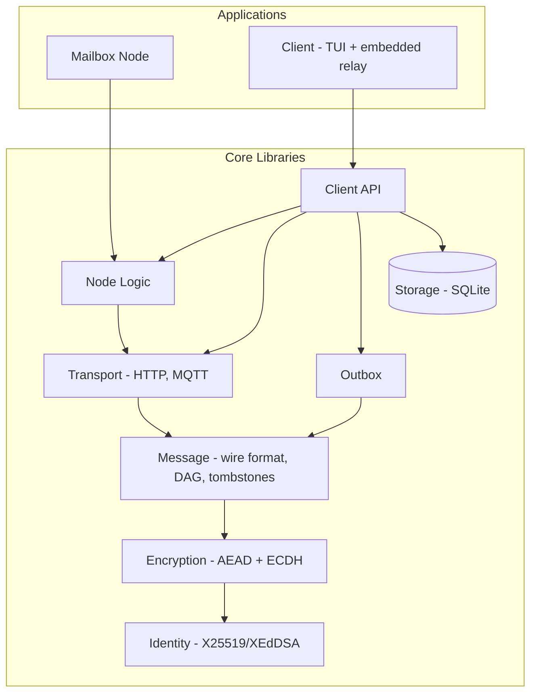
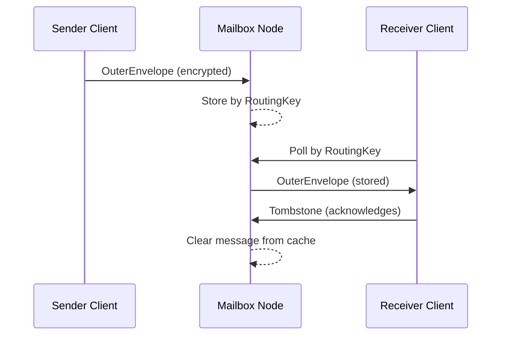
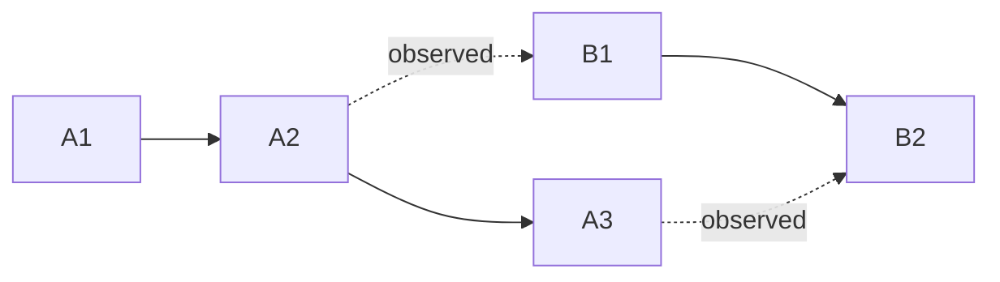
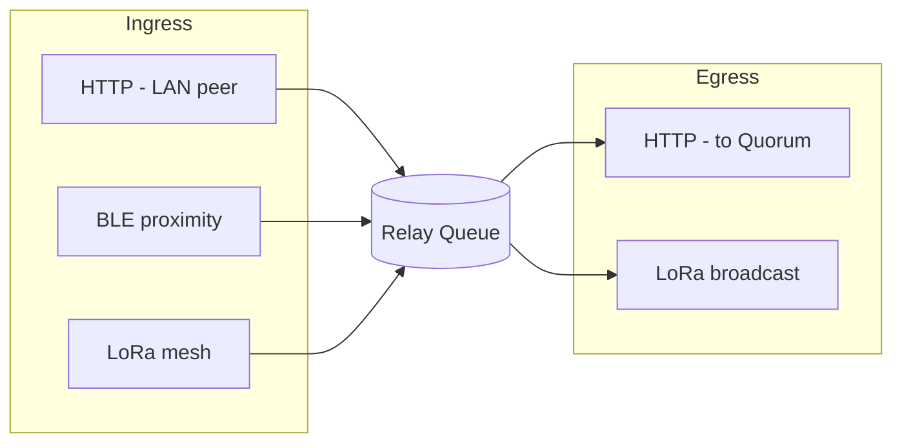
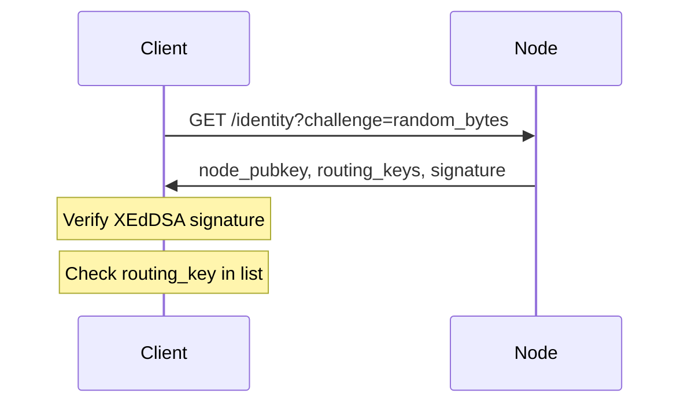

# Resilient Messenger (reme)

## A Delay-Tolerant, End-to-End Encrypted Messaging Protocol

**Version 0.3 (Tiered Delivery)**
**January 2026**

---

## Abstract

Resilient Messenger (reme) is an outage-resilient, end-to-end encrypted messaging system for environments where network connectivity is intermittent, constrained, or adversarial. Unlike traditional messengers that depend on always-on Internet connectivity, reme uses a hybrid transport architecture: HTTP mailboxes, LoRa mesh networks, BLE proximity exchange, and other constrained transports.

The protocol uses XEdDSA signatures, X25519 key exchange, and ChaCha20-Poly1305 authenticated encryption, while keeping a minimal wire format suitable for bandwidth-constrained channels. A Merkle DAG message ordering system tracks causal ordering without centralized coordination, allowing gap detection and state recovery across disconnected operation periods.

This paper presents the complete protocol specification, threat model, cryptographic rationale, and comparison with existing secure messaging systems including Signal, Session, Matrix, and Briar.

---

## Table of Contents

1. [Introduction](#1-introduction)
2. [Terminology](#2-terminology)
3. [Problem Statement](#3-problem-statement)
4. [Design Goals and Constraints](#4-design-goals-and-constraints)
5. [System Architecture](#5-system-architecture)
6. [Identity and Key Management](#6-identity-and-key-management)
7. [Cryptographic Design](#7-cryptographic-design)
8. [Message Format and Wire Protocol](#8-message-format-and-wire-protocol)
9. [DAG-Based Message Ordering](#9-dag-based-message-ordering)
10. [Tombstone System](#10-tombstone-system)
11. [Transport Layer](#11-transport-layer)
12. [Security Analysis](#12-security-analysis)
13. [Comparison with Existing Systems](#13-comparison-with-existing-systems)
14. [Future Directions](#14-future-directions)
15. [Conclusion](#15-conclusion)

---

## 1. Introduction

Modern secure messaging systems protect message content well through end-to-end encryption. But they depend on reliable Internet connectivity and centralized infrastructure. This dependency creates real vulnerabilities:

- **Natural disasters** often destroy or overwhelm communication infrastructure when coordination matters most
- **Authoritarian regimes** can block messaging services at will
- **Remote areas** lack reliable connectivity for conventional messaging
- **Infrastructure attacks** can disable communications for entire regions

Reme takes a different approach: designing for intermittent, constrained, and potentially adversarial network conditions from the start, rather than treating them as edge cases.

### 1.1 What's different

1. **Stateless encryption**: Each message is independently decryptable using ephemeral key exchange. No session state synchronization needed across devices or transport failures.

2. **Merkle DAG message ordering**: Content-addressed message identifiers form a directed acyclic graph for causality detection and gap identification without centralized servers.

3. **Transport-agnostic design**: The same encrypted message can traverse HTTP, LoRa, BLE, or any future transport, with bandwidth-appropriate metadata for constrained channels.

4. **Cryptographic tombstones**: Signed acknowledgments allow cache management and delivery confirmation while hiding sender-receiver relationships from relay nodes.

---

## 2. Terminology

| Term | Definition |
|------|------------|
| **DTN** (Delay-Tolerant Networking) | A network architecture where end-to-end connectivity is intermittent or never available. Messages are stored and forwarded hop-by-hop. Reme is designed for DTN conditions: no session state, independent message processing, tolerance for loss and reordering. |
| **Stateless encryption** | Each message carries its own key exchange material (ephemeral X25519 keypair). No session establishment, no prekeys, no ratchet state. Any single message can be decrypted independently. The tradeoff: no per-message forward secrecy until v1.0 adds Noise XX sessions. |
| **MIK** (Master Identity Key) | A user's long-term X25519 keypair. Used for both encryption (ECDH) and signatures (XEdDSA). One key per identity. |
| **PublicID** | The public half of a MIK. 32 bytes. Acts as both the user's address and encryption target. |
| **RoutingKey** | First 16 bytes of `BLAKE3(PublicID)`. Used for mailbox addressing so relay nodes never see the full PublicID. |
| **OuterEnvelope** | The encrypted wire format visible to relay nodes. Contains routing metadata (RoutingKey, coarse timestamp, TTL), the ephemeral public key, and the encrypted InnerEnvelope. |
| **InnerEnvelope** | The authenticated plaintext inside an OuterEnvelope. Contains sender identity, precise timestamp, message content, DAG references, and signature. Only the recipient can read it. |
| **MessageID** | A 128-bit UUID v4 assigned when a message is created. Used for deduplication and tombstone targeting. Not content-addressed. |
| **ContentId** | An 8-byte BLAKE3 hash of a message's immutable fields (sender, timestamp, content). Used for DAG references. Unlike MessageID, two sends of identical content produce the same ContentId. |
| **DAG** (Directed Acyclic Graph) | The causal ordering structure formed by `prev_self` and `observed_heads` references between messages. Tracks causality and enables gap detection without a central server. |
| **Epoch** | A per-conversation counter in the DAG. Incremented on intentional history clear. Messages from different epochs are not causally linked. |
| **Detached message** | A message sent without DAG references (`prev_self: None`, `observed_heads: []`, `FLAG_DETACHED`). Used on constrained transports (BLE, LoRa) to save ~16 bytes of overhead. Does not trigger state-reset detection. |
| **Tombstone** | A signed acknowledgment that a recipient has received a specific message. Relay nodes use tombstones to clear their caches. Optionally carries an encrypted delivery/read receipt for the sender. |
| **ack_secret** | A 16-byte value derived from the ECDH shared secret: `BLAKE3_KDF("reme-ack-v1", shared_secret \|\| message_id)[0..16]`. Only the sender and recipient can compute it. The recipient includes it in a tombstone to prove they decrypted the message. |
| **ack_hash** | `BLAKE3_KDF("reme-ack-hash-v1", ack_secret)[0..16]`. Stored in the OuterEnvelope so relay nodes can verify tombstone authorization in O(1) without knowing any identity. |
| **Transport** | A mechanism for moving OuterEnvelopes between nodes: HTTP, MQTT, BLE, LoRa, or sneakernet. Transports are interchangeable; the same encrypted envelope works on any of them. |
| **Mailbox node** | An always-on server that stores and forwards OuterEnvelopes for recipients, indexed by RoutingKey. The primary Internet-based infrastructure. |
| **Peer relay** | A store-and-forward queue on a peer device that bridges transports (e.g., BLE-received messages forwarded to Quorum over HTTP). Unlike mailbox nodes, peer relays are transient and run on end-user devices. See §11.5. |
| **Ingress adapter** | A component that accepts OuterEnvelopes from a specific transport and deposits them into the peer relay queue. Example: HTTP ingress (LAN peer submits envelope). |
| **Egress adapter** | A component that drains the peer relay queue and forwards OuterEnvelopes over a different transport. Example: HTTP egress (forward to Quorum mailbox). |
| **Outbox** | The client-side persistent queue for outgoing messages. Handles retry scheduling and quorum tracking. A message stays in the outbox until the recipient acknowledges it via DAG references or tombstone. |
| **Delivery tiers** | The three priority levels for message delivery. **Direct**: ephemeral targets (mDNS-discovered peers), race all, exit on first success. **Quorum**: stable targets (HTTP/MQTT mailboxes), require configurable quorum. **BestEffort**: fire-and-forget (future mesh transports). Ephemeral targets are transient (discovered via mDNS, may disappear); stable targets are configured and long-lived. |
| **Quorum** (delivery) | A strategy governing how many Quorum-tier targets must accept a message before it is considered delivered. Strategies: Any, Count(n), Fraction(f), All. |

---

## 3. Problem Statement

### 3.1 Limitations of existing systems

Traditional secure messengers have architectural limitations that reme addresses:

| System  | Limitation                                                   | reme Solution                                             |
|---------|--------------------------------------------------------------|-----------------------------------------------------------|
| Signal  | Requires server-mediated key exchange, phone number identity | Self-sovereign identity, stateless encryption             |
| Session | Onion routing adds latency, large node requirements          | Direct mailbox routing with privacy-preserving addressing |
| Matrix  | Federation complexity, metadata leakage                      | Simple store-forward, coarse timestamps                   |
| Briar   | Tor dependency, no offline operation                         | Multi-transport, DTN-compatible design                    |

### 3.2 Threat model

reme is designed to resist these adversaries:

**Network-level adversaries:**
- Passive observers attempting traffic analysis
- Active attackers injecting or modifying messages
- Infrastructure operators attempting message suppression

**Endpoint adversaries:**
- Compromised relay nodes
- Malicious senders attempting impersonation
- Attackers attempting replay or reordering

**Key compromise:**
- Loss of device does not compromise past messages
- Future security after key compromise (with session ratcheting in v2)

### 3.3 Security goals

1. **Confidentiality**: Only intended recipients can read message content
2. **Authenticity**: Recipients can verify sender identity
3. **Integrity**: Any modification to messages is detectable
4. **Forward secrecy**: Compromise of long-term keys does not expose past messages
5. **Metadata minimization**: Relay nodes learn minimal information about communication patterns
6. **Repudiation**: Third parties cannot cryptographically prove who sent a message (deniability)

---

## 4. Design Goals and Constraints

### 4.1 Primary goals

1. **Outage resilience**: Continue functioning during network partitions, infrastructure failures, or deliberate blocking
2. **Transport flexibility**: Support multiple transport mechanisms with graceful degradation
3. **Minimal state**: Reduce synchronization requirements between devices and across transport failures
4. **Bandwidth efficiency**: Operate on severely constrained channels (LoRa: ~200 bytes/message)
5. **Cryptographic soundness**: Use well-analyzed primitives with conservative security margins

### 4.2 Design constraints

**Wire format constraints:**
- Outer envelope: ~102 bytes minimum overhead
- Inner envelope: Scales with content (~62 bytes minimum for empty text)
- LoRa MTU: ~200 bytes (requires fragmentation for larger messages)
- Total encrypted text message: ~180-220 bytes typical

**Operational constraints:**
- No mandatory central servers (mailboxes are optional relays)
- No phone numbers or external identifiers required
- Single persistent identity across all transports
- Offline-first message composition

---

## 5. System Architecture

### 5.1 Logical components



### 5.2 Message flow



**Send path:**
1. Client creates `InnerEnvelope` with content and DAG references
2. Signs with sender's XEdDSA key
3. Encrypts to recipient's MIK (Master Identity Key) using ephemeral ECDH
4. Wraps in `OuterEnvelope` with routing metadata
5. Submits to transport (HTTP mailbox, LoRa, etc.)

**Receive path:**
1. Client fetches messages by routing key
2. Decrypts using MIK private key
3. Verifies sender signature
4. Processes DAG references for gap detection
5. Sends tombstone to acknowledge receipt

### 5.3 Addressing model

**PublicID (32 bytes):** The user's X25519 public key, used as both address and encryption target.

**RoutingKey (16 bytes):** First 16 bytes of BLAKE3 hash of PublicID. Used for mailbox addressing without revealing the full identity.

```
routing_key = BLAKE3(public_id)[0:16]
```

This gives us:
- **Privacy**: Routing key cannot be reversed to PublicID
- **Collision resistance**: 128-bit space is sufficient for addressing
- **Efficiency**: Compact lookup keys for relay storage

---

## 6. Identity and Key Management

### 6.1 Single-key identity

reme uses a single X25519 key for both encryption and signatures (via XEdDSA). This means:

- **32-byte addresses**: Compact, human-verifiable identities
- **Simplified backup**: Single secret key backs up entire identity
- **Cross-curve compatibility**: XEdDSA provides Ed25519-compatible signatures from X25519 keys

An identity consists of a PublicID (X25519 public key, 32 bytes) and the corresponding X25519 private key (32 bytes).

### 6.2 XEdDSA signatures

XEdDSA (eXtended EdDSA) allows signing with X25519 keys through the birational map between Montgomery (Curve25519) and Twisted Edwards (Ed25519) forms:

```
Ed25519_pubkey = birational_map(X25519_pubkey, sign_bit=0)
```

Properties:
- Deterministic signatures using nonce derived from message and key
- Ed25519-compatible verification
- 64-byte signatures

### 6.3 Low-order point validation

All public keys are validated against the 7 known small-order points on Curve25519 that would produce predictable shared secrets (the identity point, two order-4 points, and four order-8 points). Defense-in-depth against invalid key attacks per RFC 7748 recommendations.

---

## 7. Cryptographic Design

### 7.1 Encryption model: MIK-only (v0.2)

The current version uses stateless encryption where each message includes its own key exchange material. The OuterEnvelope carries a fresh ephemeral X25519 public key alongside the encrypted InnerEnvelope (see §8.1 for full field list).

**Encryption (sender):**
```
1. Generate ephemeral keypair (e, E)
2. shared_secret = X25519(e, recipient_MIK)
3. enc_key = BLAKE3_KDF("reme-encryption-key-v0", E || recipient_MIK || shared_secret)
4. nonce = BLAKE3_KDF("reme-nonce-v0", message_id || recipient_MIK)[0:12]
5. ciphertext = ChaCha20Poly1305_Encrypt(enc_key, nonce, plaintext, AAD=message_id)
```

**Decryption (recipient):**
```
1. shared_secret = X25519(mik_private, ephemeral_key)
2. enc_key = BLAKE3_KDF("reme-encryption-key-v0", ephemeral_key || mik_public || shared_secret)
3. nonce = BLAKE3_KDF("reme-nonce-v0", message_id || mik_public)[0:12]
4. plaintext = ChaCha20Poly1305_Decrypt(enc_key, nonce, ciphertext, AAD=message_id)
```

### 7.2 Triple binding

Each message cryptographically binds three elements:

1. **Nonce derivation**: `nonce = f(message_id, recipient_pk)` - binds message to recipient
2. **AAD verification**: `message_id` as additional authenticated data - binds ciphertext to message
3. **Signature**: `sign(from || timestamp || content || DAG_fields || message_id)` - binds sender to content

This prevents:
- Message forwarding attacks (recipient binding)
- Message ID manipulation (AAD binding)
- Sender impersonation (signature binding)

### 7.3 Key derivation

All key derivation uses BLAKE3 in KDF mode with context strings for domain separation:

```
enc_key = BLAKE3_KDF("reme-encryption-key-v0", ephemeral_pub || recipient_pub || shared_secret)
```

Including both public keys in the KDF input prevents key confusion attacks where an attacker might claim a ciphertext was intended for a different recipient.

### 7.4 Future: Async Noise handshake (v1.0)

Version 1.0 will add the **Async DTN-Safe Noise XX Handshake** for forward secrecy and post-compromise security:

1. Encrypted sender in OuterEnvelope (+16 bytes)
2. Either party can initiate (deterministic roles)
3. Epoch-based replay protection
4. DAG-integrated key lifecycle (delete after ACK)
5. MIK fallback when session unavailable

---

## 8. Message Format and Wire Protocol

### 8.1 OuterEnvelope

The outer envelope contains routing metadata visible to relay nodes:

| Field | Size | Description |
|-------|------|-------------|
| version | 2 bytes | Major.minor protocol version |
| routing_key | 16 bytes | Truncated BLAKE3 of recipient PublicID |
| timestamp_hours | 4 bytes | Hour-granularity timestamp (see §8.5) |
| ttl_hours | 0 or 3 bytes | Optional time-to-live |
| message_id | 16 bytes | UUID v4 for deduplication |
| ack_hash | 16 bytes | For tombstone authorization (see §2) |
| ephemeral_key | 32 bytes | Per-message X25519 public key |
| inner_ciphertext | variable | Encrypted InnerEnvelope + Poly1305 tag |

> **Wire format note:** Field sizes and encoding are subject to change. The current implementation uses bincode; a migration to Postcard is planned before v0.5, with Protobuf at v1.0. See Appendix B for current size estimates.

### 8.2 InnerEnvelope

The inner envelope contains authenticated message data, readable only by the recipient:

| Field | Size | Description |
|-------|------|-------------|
| from | 32 bytes | Sender's PublicID |
| created_at_ms | 8 bytes | Millisecond-precision timestamp |
| content | variable | Message content (see §8.3) |
| signature | 0 or 64 bytes | XEdDSA signature over all fields |
| prev_self | 0 or 8 bytes | ContentId of sender's previous message |
| observed_heads | variable | ContentIds of peer's latest seen messages |
| epoch | 2 bytes | Conversation epoch counter |
| flags | 1 byte | Flags (e.g., FLAG_DETACHED) |

### 8.3 Content types

Messages carry one of:

- **Text**: UTF-8 string body
- **Receipt**: References a MessageID with a status (Delivered or Read)

### 8.4 Wire type discrimination

Messages and tombstones share the transport with a 1-byte discriminator:

```
0x00: Message (OuterEnvelope)
0x01: Tombstone (TombstoneEnvelope)
```

### 8.5 Timestamp design

reme uses a dual-timestamp model for privacy:

- **Outer envelope**: Hour-granularity (`u32`, ~490,000 year range)
- **Inner envelope**: Millisecond precision (`u64`)

Hour granularity on the outer envelope:
- Limits timing analysis by relay nodes
- Saves 4 bytes vs. millisecond timestamps
- Sufficient for TTL enforcement

---

## 9. DAG-Based Message Ordering

### 9.1 Content-addressed identifiers

Each message has a content-addressed ID computed from immutable fields:

```
content_id = BLAKE3("reme-content-id-v1" || sender_pubid || timestamp_ms || content)[0:8]
```

**Design rationale:**
- 8 bytes provides ~4 billion messages before birthday collision
- BLAKE3 truncation is safe (XOF design)
- DAG fields excluded so resends maintain same content_id

### 9.2 DAG structure

Messages form a directed acyclic graph through references:



- **Solid arrows** (`prev_self`): Link a sender's own messages into a chain (A1 → A2 → A3, B1 → B2)
- **Dotted arrows** (`observed_heads`): Reference the peer's latest message seen at send time

**Fields:**
- `prev_self`: Reference to sender's previous message (chain continuity)
- `observed_heads`: References to peer's latest messages seen (acknowledgment)
- `epoch`: Conversation epoch (increments on history clear)
- `flags`: Message flags (e.g., `FLAG_DETACHED` for constrained transports)

### 9.3 Gap detection

Two gap detectors operate on each conversation:

**Receiver gap detector** tracks incoming message ancestry. When a message arrives, the detector checks whether its `prev_self` parent is already known. If the parent is missing, the message is an "orphan" held in a buffer until the parent arrives. When a parent arrives, all downstream orphans are resolved in chain order.

**Sender gap detector** tracks what the peer has acknowledged. By examining the peer's `observed_heads`, the sender can identify which of its own messages the peer has not yet seen and schedule resends.

### 9.4 Multi-head support

The DAG supports multiple heads (fork scenarios):

- **Multi-device**: Same user sending from phone + laptop creates parallel chains
- **Concurrent sends**: Race conditions creating parallel branches

The sender gap detector tracks all current heads and resolves forks when a new message references multiple parents.

### 9.5 State reset detection

Three anomaly conditions are detected:

1. **Sender state reset**: Peer sends `prev_self=None` without `FLAG_DETACHED` when we have history
2. **Local state behind**: Peer's `observed_heads` contains IDs we don't recognize
3. **Epoch mismatch**: Peer advanced epoch (intentional history clear)

### 9.6 Detached messages

For constrained transports (LoRa, BLE), messages can be sent without DAG linkage by setting the `FLAG_DETACHED` flag. A detached message has no `prev_self` or `observed_heads` references.

Detached messages:
- Save ~16 bytes of DAG overhead
- Can be linked later when followed by a linked message
- Don't trigger state reset detection

---

## 10. Tombstone System

### 10.1 Purpose

Tombstones have two purposes:

1. **Network layer**: Cache clearing and duplicate delivery prevention
2. **Application layer**: Optional delivery/read receipts

### 10.2 Tombstone format

> **WIP:** The tombstone wire format is being revised. The current implementation uses ack_secret-based authorization (V2), which differs from the V1 design described here. The fields below will be updated once the format stabilizes.

A tombstone contains:
- The target MessageID being acknowledged
- The RoutingKey of the mailbox where the message was stored
- An `ack_secret` proving the recipient decrypted the message (see §2)
- An XEdDSA signature for attribution

### 10.3 Security properties

**Authorization without identity**: Relay nodes verify tombstones by checking `BLAKE3(ack_secret) == ack_hash` from the OuterEnvelope. This is an O(1) hash comparison that requires no knowledge of sender or recipient identity.

**Attribution**: Clients verify the XEdDSA signature to determine whether the tombstone came from the sender or recipient.

**Verifiable by relays**: Any node can verify tombstone authorization without decrypting messages.

### 10.4 Encrypted receipt (optional)

Tombstones can optionally carry a receipt encrypted for the sender (ephemeral X25519 + ChaCha20-Poly1305). The receipt includes a precise timestamp, delivery status (Delivered, Read, or Deleted), and optionally a proof-of-content HMAC.

---

## 11. Transport Layer

### 11.1 Transport interface

All transports implement two operations:
- **Submit message**: Send an OuterEnvelope to a destination
- **Submit tombstone**: Send a tombstone acknowledgment

Transports are asynchronous and may fail independently. A transport coordinator routes messages across available transports and handles failover.

### 11.2 HTTP transport

Primary transport for reliable connectivity:

- **Endpoint**: `POST /api/v1/messages` (submit)
- **Endpoint**: `GET /api/v1/messages/:routing_key` (fetch)
- **Endpoint**: `POST /api/v1/tombstones` (acknowledge)

### 11.3 Future transports

**LoRa/Meshtastic:**
- MTU: ~200 bytes
- Requires fragmentation for larger messages
- Uses detached messages to minimize overhead
- Store-and-forward through mesh network
- Can act as both relay ingress and egress (see §11.5)

**BLE proximity:**
- Direct device-to-device exchange
- Background scanning for contacts
- Can act as relay ingress for Internet-connected peers (see §11.5)

**Sneakernet:**
- QR code or file-based message transfer
- Complete offline operation

### 11.4 Mailbox node

A mailbox node stores OuterEnvelopes indexed by RoutingKey and delivers them when clients poll. TTL enforcement removes expired messages; tombstones clear acknowledged ones.

Nodes learn only:
- Routing keys (not full identities)
- Message sizes
- Coarse timestamps (hour granularity)
- When tombstones clear messages

### 11.5 Peer relay architecture (v0.6+)

Mailbox nodes are always-on infrastructure. Peer relay covers partial availability: some peers have Internet access, others don't.

The relay is a store-and-forward queue with pluggable ingress and egress adapters:



The queue stores encrypted `OuterEnvelope` blobs. Relay nodes never decrypt, so any device can relay without holding private keys.

**Ingress adapters** accept envelopes from one transport and deposit them into the queue. **Egress adapters** drain the queue and forward envelopes over a different transport. A single relay node can run multiple adapters at once (e.g., BLE ingress + HTTP egress on a phone, or HTTP ingress + LoRa egress on a home gateway).

v0.6 ships with HTTP-only ingress and egress. v0.7 adds BLE ingress, v0.8 adds LoRa ingress and LoRa egress.

**Trust model:** Same as mailbox nodes. Relay nodes see routing keys, message sizes, and coarse timestamps. E2E encryption prevents relay nodes from reading, modifying, or forging message content.

### 11.6 Node identity verification (v0.4)

For dynamically discovered peers (mDNS), identity verification ensures messages reach the intended recipient.

**Challenge-response protocol:**



**Two operating modes:**

| Mode | Use Case | Identity Required |
|------|----------|-------------------|
| **Direct** | Peer IS the recipient | Yes - verify `routing_key` matches |
| **Relay** | Peer forwards to external recipient | No - E2E encrypted payload |

**Background refresh:**
- Periodic identity refresh (5 min default) detects DHCP reassignment
- Refresh on delivery failure or network change
- Stale identities removed from Direct tier automatically

---

## 12. Security Analysis

### 12.1 Confidentiality

**Message content**: Protected by ChaCha20-Poly1305 authenticated encryption with per-message ephemeral keys.

**Metadata**: Coarse timestamps, routing keys (not full identities), and message sizes are visible to relays.

### 12.2 Authenticity

**Sender verification**: XEdDSA signature in `InnerEnvelope` proves sender identity.

**Message integrity**: Poly1305 MAC prevents modification.

**Recipient binding**: ECDH ensures only intended recipient can decrypt.

### 12.3 Forward secrecy

**MIK-only (v0.3)**: Limited forward secrecy - compromise of MIK reveals all messages encrypted to it.

**Async Noise (v1.0)**: Will provide per-session forward secrecy through Noise XX handshake with DAG-integrated key lifecycle. Keys deleted after DAG acknowledgment.

### 12.4 Replay protection

**Messages**: UUID message_id provides uniqueness.

**Tombstones**: Timestamp + sequence + device_id prevents replay.

### 12.5 Denial of service

**Message flooding**: Rate limiting at relay nodes.

**Storage exhaustion**: TTL enforcement, tombstone clearing.

**Invalid key attacks**: Low-order point validation.

### 12.6 Side channels

**Timing**: Hour-granularity outer timestamps limit timing analysis.

**Message size**: No padding in v0.2; fixed-size padding planned for v1.0.

---

## 13. Comparison with Existing Systems

### 13.1 Signal Protocol

| Aspect            | Signal                            | reme                                           |
|-------------------|-----------------------------------|------------------------------------------------|
| Key Exchange      | X3DH with server-mediated prekeys | Direct MIK encryption, Noise XX (v1.0)         |
| Forward Secrecy   | Double Ratchet                    | Per-ephemeral-key, per-session Noise XX (v1.0) |
| Identity          | Phone number                      | Self-sovereign 32-byte key                     |
| Server Dependency | Required for delivery             | Optional mailboxes                             |
| Offline First     | No                                | Yes                                            |

### 13.2 Session Protocol

| Aspect           | Session                         | reme                |
|------------------|---------------------------------|---------------------|
| Routing          | Onion request via service nodes | Direct to mailbox   |
| Latency          | Higher (onion routing)          | Lower (direct)      |
| Decentralization | Oxen network required           | Any mailbox, or P2P |
| Message Ordering | Server timestamps               | Merkle DAG          |

### 13.3 Matrix Protocol

| Aspect       | Matrix                 | reme                 |
|--------------|------------------------|----------------------|
| Architecture | Federated servers      | Optional mailboxes   |
| Room Model   | Multi-user rooms       | 1:1 (groups planned) |
| Encryption   | Megolm + Olm           | X25519 + ChaCha20    |
| Metadata     | Significant to servers | Minimal to relays    |

### 13.4 Briar

| Aspect       | Briar            | reme                      |
|--------------|------------------|---------------------------|
| Network      | Tor, BT, WiFi    | HTTP, LoRa, BLE (planned) |
| Desktop      | Android only     | Cross-platform (Rust)     |
| Offline      | Requires restart | Continuous operation      |
| Message Sync | Per-contact DAG  | Per-contact DAG           |

---

## 14. Future Directions

### 14.1 Version 1.0: Async Noise handshake

- Noise XX session establishment (no prekey servers)
- Encrypted sender field for key-loss recovery
- DAG-integrated key lifecycle (delete after ACK)
- Per-session forward secrecy

### 14.2 Group messaging

- Sender Keys for efficient group encryption
- Group membership DAG
- Admin operations (add/remove/promote)

### 14.3 Alternative transports

- Satellite uplinks
- Ham radio digital modes

### 14.4 Privacy improvements

- Fixed-size message padding
- Cover traffic
- Routing key rotation
- Mixnet integration

### 14.5 State recovery

- Merkle accumulator sync
- Selective message resync
- Cross-device state merge

---

## 15. Conclusion

Reme is a different approach to secure messaging for adversarial network conditions. It combines stateless encryption (each message is independently processable), Merkle DAG ordering (decentralized causality), transport-agnostic design (constrained channels work), and cryptographic tombstones (verifiable acknowledgments).

The current MIK-only implementation provides a solid foundation, with a clear upgrade path to Async Noise XX handshake for forward secrecy. The modular Rust implementation can be embedded in command-line tools, mobile apps, and embedded devices.

The tradeoff is explicit: reme prioritizes resilience and DTN tolerance over the per-message forward secrecy that Double Ratchet provides. For users who need messaging when infrastructure fails, this tradeoff makes sense.

---

## Appendices

### A. Cryptographic primitive summary

| Primitive    | Algorithm         | Parameters                             |
|--------------|-------------------|----------------------------------------|
| Key Exchange | X25519            | Curve25519, 32-byte keys               |
| Signatures   | XEdDSA            | Ed25519-compatible, 64-byte signatures |
| Encryption   | ChaCha20-Poly1305 | 256-bit key, 96-bit nonce, 128-bit tag |
| Hashing      | BLAKE3            | Variable output, XOF mode              |
| KDF          | BLAKE3-KDF        | Context strings for domain separation  |
| Message ID   | UUID v4           | 128-bit random                         |
| Content ID   | BLAKE3 truncated  | 64-bit (8 bytes)                       |

### B. Wire format sizes

> **WIP:** These sizes reflect the current bincode encoding. A migration to Postcard is planned before v0.5; wire sizes may change by up to ~5%. The v1.0 Protobuf migration will change the encoding entirely.

| Component              | Size                         |
|------------------------|------------------------------|
| PublicID               | 32 bytes                     |
| RoutingKey             | 16 bytes                     |
| MessageID              | 16 bytes                     |
| ContentId              | 8 bytes                      |
| Signature              | 64 bytes                     |
| Poly1305 tag           | 16 bytes                     |
| OuterEnvelope overhead | ~73 bytes (bincode)          |
| InnerEnvelope minimum  | ~107 bytes (with signature)  |
| Tombstone              | TBD (V2 format)              |

### C. References

1. Perrin, T., & Marlinspike, M. (2016). The X3DH Key Agreement Protocol.
2. Perrin, T., & Marlinspike, M. (2016). The Double Ratchet Algorithm.
3. Hamburg, M. (2015). The XEdDSA and VXEdDSA Signature Schemes.
4. Bernstein, D.J. (2006). Curve25519: new Diffie-Hellman speed records.
5. Nir, Y., & Langley, A. (2018). RFC 8439: ChaCha20 and Poly1305.
6. O'Connor, J., et al. (2020). BLAKE3: one function, fast everywhere.

---

*This document describes Resilient Messenger version 0.3 (Tiered Delivery). The protocol is under active development; specifications may change.*

## Appendix D. Current implementation status (v0.3)

### Completed features

**Core cryptography & protocol (v0.2):**
- X25519/XEdDSA identity system
- MIK-based stateless encryption
- ChaCha20-Poly1305 AEAD with per-message ephemeral keys
- BLAKE3 key derivation with domain separation
- XEdDSA signatures for message authentication
- Low-order point validation
- Tombstone V2 (ack_secret-based authorization)
- Merkle DAG message ordering with gap detection

**Transport & delivery (v0.3):**
- HTTP transport with TLS/certificate pinning
- MQTT transport (pub/sub)
- TransportCoordinator for multi-transport routing
- Tiered delivery (Direct/Quorum/BestEffort)
- Three-phase delivery state machine (Urgent/Distributed/Confirmed)
- Configurable quorum strategies (Any/Count/Fraction/All)
- Per-transport retry policies with exponential backoff
- Embedded HTTP server for LAN P2P messaging
- Node-to-node authentication with XEdDSA signatures

**Storage & state:**
- SQLite persistence for messages and contacts
- Outbox with delivery state tracking
- Receiver gap detector (orphan tracking)
- Sender gap detector (epoch-based)
- DAG-based implicit acknowledgments

**Security & hardening:**
- HTTP Basic Auth for node access
- Rate limiting (per-IP and per-routing-key)
- Body size limits (256 KiB max)
- Memory zeroization for credentials
- Constant-time comparisons for auth

**Applications:**
- TUI client with ratatui
- Mailbox node server
- Client-as-relay capability (embedded node)

### In progress

**Current development (v0.4):**
- mDNS/Bonjour LAN discovery
- Discovery-flow integration for challenge-response node identity verification
- Background identity refresh for Direct tier targets

### Planned features (see ROADMAP.md)

**v0.5:**
- Sneakernet export/import (archive files, QR codes)
- Air-gapped message transfer

**v0.6:**
- Store-and-forward relay queue with pluggable ingress/egress
- LAN relay mode (HTTP ingress/egress) for partial outage scenarios

**v0.7:**
- BLE proximity exchange
- BLE relay ingress adapter
- Message fragmentation for constrained transports

**v0.8:**
- LoRa/Meshtastic mesh integration
- LoRa relay ingress and egress adapters
- Multi-hop store-and-forward routing
- Kilometers-range messaging without Internet

**v1.0 (breaking release):**
- Protobuf wire format for cross-language compatibility
- Async Noise XX handshake for forward secrecy
- DAG-integrated key lifecycle

**Post-v1.0:**
- Group messaging (Sender Keys)
- Cross-device state synchronization
- Privacy improvements (padding, cover traffic)
