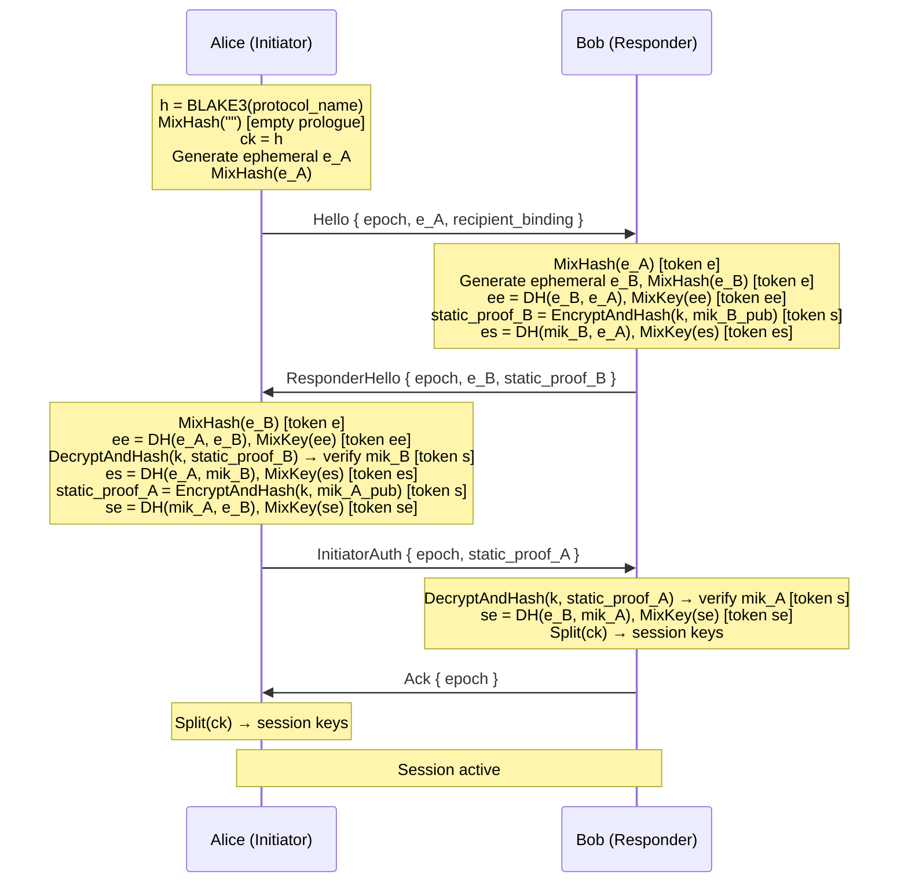
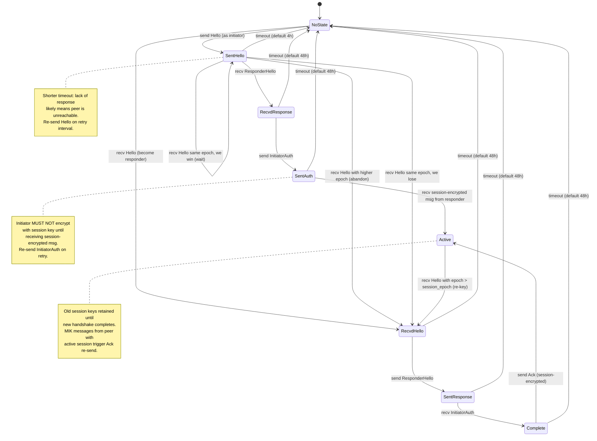
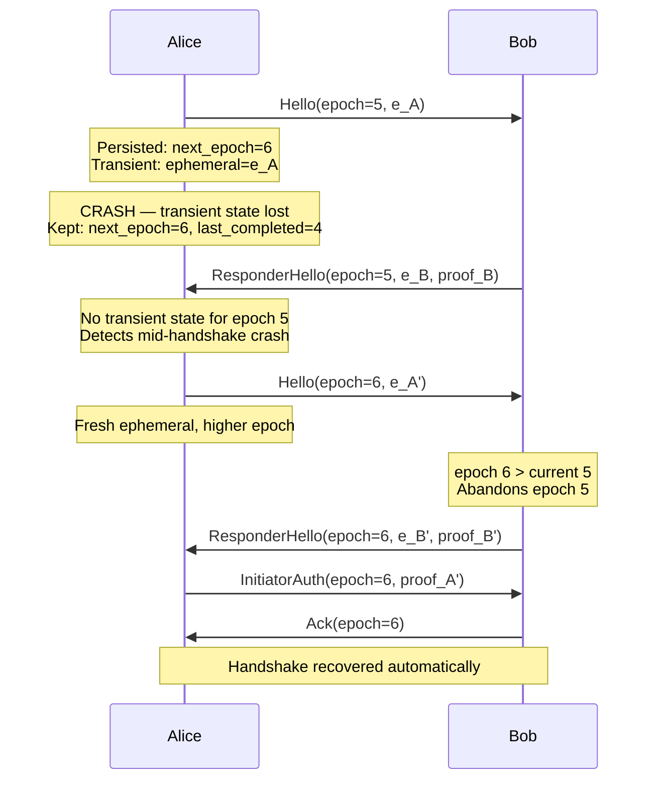
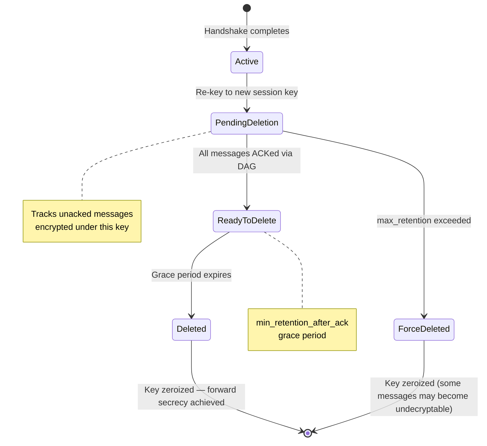
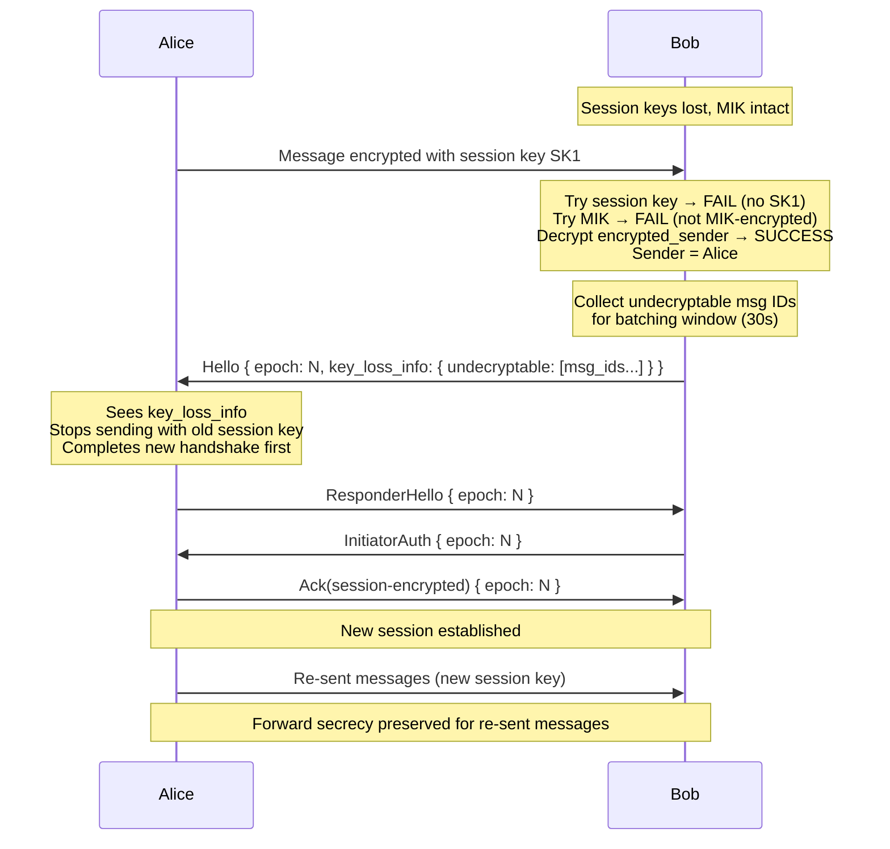

# Session Encryption (Async Noise XX)

Session-based encryption with forward secrecy for ember, using an asynchronous adaptation of the Noise XX handshake pattern designed for delay-tolerant networks.

## Overview

Session encryption establishes ephemeral shared keys between two peers via a 4-message Noise XX handshake carried inside standard ember envelopes. Once established, a session key replaces per-message MIK-based sealed boxes, providing forward secrecy.

The protocol is fully asynchronous and DTN-safe: every handshake message is a normal ember envelope that can tolerate arbitrary delays, reordering, and loss. MIK-based stateless encryption remains the fallback for first contact and key loss recovery.

### Protocol name

```
ember-session-xx-v1-25519-chapoly-blake3
```

This identifies the exact combination of primitives: Noise XX pattern, X25519 DH, ChaCha20Poly1305 AEAD, BLAKE3 for hashing and KDF. The protocol name is used as the initial handshake hash (see [Handshake state](#handshake-state)).

## Motivation

MIK-based stateless encryption offers zero-RTT messaging but no forward secrecy — compromising a MIK exposes all past and future messages. Session encryption limits the blast radius of key compromise to a single epoch.

## Envelope format

### OuterEnvelope

The outer envelope gains one new field (`encrypted_sender`) compared to the current format:

| Field              | Size      | Description                                               |
|--------------------|-----------|-----------------------------------------------------------|
| `version`          | 2 bytes   | Major.minor protocol version                              |
| `routing_key`      | 16 bytes  | Truncated BLAKE3 of recipient PublicID                    |
| `message_id`       | 16 bytes  | UUID v4 for deduplication                                 |
| `ephemeral_key`    | 32 bytes  | Per-message X25519 public key                             |
| `encrypted_sender` | 48 bytes  | **New.** Sender MIK encrypted to recipient (32B + 16B tag)|
| `timestamp_hours`  | 4 bytes   | Hour-granularity timestamp                                |
| `ttl_hours`        | 0–3 bytes | Optional time-to-live                                     |
| `encrypted_payload`| variable  | Session-key or MIK encrypted content                     |

The `encrypted_sender` field allows the recipient to identify the sender even when session keys are lost. It is always encrypted with the recipient's MIK via the per-message ephemeral key, so it remains decryptable regardless of session state.

Note: `encrypted_sender` provides a more efficient metadata extraction path upon MIK compromise compared to the current design where `from` is inside the encrypted payload. This is an accepted trade-off for enabling key loss recovery.

### Encrypted sender derivation

The sender's MIK public key (32 bytes) is encrypted to the recipient using ChaCha20Poly1305:

- **Key:** `BLAKE3_KDF("ember-outer-sender-v1", DH(ephemeral_secret, recipient_mik) || message_id)`
- **Nonce:** `[0u8; 12]` (fixed zero nonce — safe because the key is unique per message via `message_id` inclusion)
- **Plaintext:** sender's MIK public key (32 bytes)
- **Output:** 48 bytes (32 bytes ciphertext + 16 bytes Poly1305 tag)

Only the intended recipient can decrypt this field (requires their MIK private key). An observer sees opaque bytes, indistinguishable from random.

The `message_id` is included in the key derivation (not used as a raw nonce) to avoid UUID v4 structural bias and to ensure key uniqueness even if an RNG failure produces duplicate ephemeral keys.

### Privacy properties

An observer (relay node, network sniffer) sees only:

- `routing_key` — reveals the recipient's truncated BLAKE3 hash (same as current design)
- `ephemeral_key` — random, unlinkable per message
- `encrypted_sender` — opaque without the recipient's MIK
- `encrypted_payload` — opaque, indistinguishable between stateless and session modes

The observer cannot determine who sent the message, what it contains, or whether it is a handshake or data message.

If the recipient's MIK is compromised, the attacker can decrypt `encrypted_sender` to learn sender identities of all buffered messages at the mailbox. Message content remains protected by the session key (if established).

### InnerEnvelope changes

The `from` field is removed from `InnerEnvelope` because sender identity is now carried in `encrypted_sender`. The `to` field is retained for authenticated recipient binding inside the encrypted payload.

A new optional `handshake` field carries handshake payloads piggybacked on regular messages.

### OuterEnvelope field authentication

| Field              | Protection          | Reason                                |
|--------------------|---------------------|---------------------------------------|
| `routing_key`      | Verify vs `inner.to`| Derived, checkable on receive         |
| `message_id`       | Bound via inner      | `outer_message_id` field in inner     |
| `ephemeral_key`    | AEAD authentication | Tampering causes decryption failure   |
| `encrypted_sender` | AEAD authentication | Tampering causes decryption failure   |
| `timestamp_hours`  | NOT signed          | DTN relays may legitimately update    |
| `ttl_hours`        | NOT signed          | Decremented as message ages in network|

Timestamp and TTL are intentionally mutable — DTN relays need to update them as messages traverse the network. Signing these fields would break relay functionality.

### Encrypted payload modes

The encrypted payload uses one of two modes, determined by the sender:

**Stateless mode** (current behavior, no session required):
- Encrypted with a key derived from `DH(ephemeral_secret, recipient_mik)`
- Contains: serialized `InnerEnvelope` bytes + 64-byte XEdDSA signature
- Any message is independently decryptable with the recipient's MIK

**Session mode** (post-handshake):
- Encrypted with a directional session key (see [Session key derivation](#session-key-derivation))
- Contains: serialized `InnerEnvelope` bytes (no signature — session AEAD provides authentication)
- Requires the recipient to have the session key (falls back to `encrypted_sender` for key loss recovery)

The mode is encoded as a discriminator byte inside the encrypted payload. Relay nodes see only the opaque `encrypted_payload` and route identically regardless of mode.

**Deniability note:** Stateless mode includes XEdDSA signatures (non-repudiable — a third party can verify). Session mode omits signatures and relies on AEAD authentication (deniable — only Alice and Bob know the session key, so neither can prove the other sent a message). This behavioral difference is intentional.

## Signature scheme

### Sign all serialized bytes (stateless mode)

Rather than signing a static list of fields (which breaks when fields are added or reordered), the signature covers the entire serialized `InnerEnvelope`:

```
encrypted_payload = encrypt(key, serialize(inner_envelope) || XEdDSA(sender_mik, serialize(inner_envelope)))
```

The signature is always the last 64 bytes of the plaintext. The receiver decrypts, splits at `len - 64`, verifies the signature over the leading bytes, then deserializes.

This approach provides forward and backward compatibility:

- **Newer sender, older receiver:** The older client verifies the signature over all bytes (valid), then deserializes and ignores trailing unknown fields.
- **Older sender, newer receiver:** The newer client verifies the signature over all bytes (valid), then deserializes with missing optional fields defaulting to `None`.

**Serialization requirements:** Fields are serialized in declaration order (postcard's default). No `HashMap`/`HashSet` types. No floating point. New fields must be appended at the end. Deserialization must tolerate trailing bytes.

### Session mode authentication

In session mode, per-message XEdDSA signatures are omitted. Authentication is provided by the AEAD tag under the directional session key — only the sender for that direction knows the key. This saves 64 bytes per message and provides deniability (see [Deniability note](#encrypted-payload-modes) above).

## Handshake protocol

The session handshake follows the Noise XX pattern adapted for asynchronous, delay-tolerant delivery. All four messages are carried inside standard ember envelopes (MIK-encrypted), so relay nodes handle them identically to normal messages.

### Noise XX pattern

The canonical Noise XX DH pattern:

```
XX:
  -> e
  <- e, ee, s, es
  -> s, se
```

In ember's adaptation:
- Static keys (`s`) are not transmitted in the handshake because both parties' MIKs are pre-known (contacts). Instead, static proofs use `EncryptAndHash` of the sender's MIK public key.
- The `s` tokens are replaced by AEAD-encrypted static proofs that bind the MIK to the handshake transcript.
- Forward secrecy is unconditional: the `ee` DH with zeroized ephemeral private keys protects session keys even if both MIKs are later compromised (see [Forward secrecy analysis](#forward-secrecy-analysis)).

### Handshake state

The handshake maintains two state variables following the Noise Framework:

- **`h` (handshake hash):** Running transcript hash. Initialized as `h = BLAKE3(protocol_name)`, then `MixHash("")` (empty prologue, per Noise Framework §5.3). Every piece of data sent or received is mixed in via `MixHash`. Used as AEAD associated data for `EncryptAndHash` operations.
- **`ck` (chaining key):** Ratcheting key, initialized to `h` (after prologue processing). Updated via `MixKey` after each DH operation. Produces intermediate symmetric keys for AEAD operations.

Note: the term "epoch" in this document refers to the handshake epoch counter, not the DAG epoch in `InnerEnvelope` (which tracks conversation history resets). These are independent counters with different semantics.

**Operations:**

| Operation | Definition |
|---|---|
| `MixHash(data)` | `h = BLAKE3(h \|\| data)` |
| `MixKey(dh_output)` | `output = BLAKE3::new_derive_key("ember-noise-ck-v1").update(ck \|\| dh_output).finalize_xof().read(64)`; `ck = output[0..32]`; `k = output[32..64]`. Uses BLAKE3 in XOF mode to produce 64 bytes from a single derivation, then splits into new chaining key and symmetric key. |
| `EncryptAndHash(k, plaintext)` | `ct = ChaCha20Poly1305(key=k, nonce=[0u8; 12], plaintext, aad=h)`, then `MixHash(ct)`. Returns `ct`. Each `k` is used for exactly one `EncryptAndHash` — if a future extension needs multiple AEAD ops per step, derive a fresh `k` via an additional `MixKey`. |
| `DecryptAndHash(k, ciphertext)` | Reverse of `EncryptAndHash`: decrypt with `aad=h`, then `MixHash(ciphertext)`. |

### Handshake messages

The handshake is carried as an optional `handshake` field in `InnerEnvelope`, meaning handshake messages can be piggybacked on regular content messages.

| Step | Message           | Noise tokens | Payload | Direction            |
|------|-------------------|-------------|---------|----------------------|
| 1    | `Hello`           | `-> e` | epoch, e, recipient_binding, optional key_loss_info | Initiator → Responder |
| 2    | `ResponderHello`  | `<- e, ee, s, es` | epoch, e, static_proof (48B) | Responder → Initiator |
| 3    | `InitiatorAuth`   | `-> s, se` | epoch, static_proof (48B) | Initiator → Responder |
| 4    | `Ack`             | (transport) | **Session-encrypted** with r2i key (see below) | Responder → Initiator |

The responder MUST send step 4 promptly after verifying `InitiatorAuth`. In DTN, the initiator cannot assume the responder will "eventually" send something — without explicit confirmation, the initiator is stuck in `SentAuth` with unusable session keys.

**Ack is a session-encrypted message.** Unlike steps 1-3 (which are MIK-encrypted), the Ack is encrypted with the responder-to-initiator session key. This provides cryptographic proof that the responder derived the correct session keys — the initiator can only decrypt it if both sides arrived at the same key material. A zero-length content body suffices; alternatively, the Ack can piggyback on a regular content message. Any session-encrypted message from the responder serves as implicit Ack.

### Handshake flow



### Static proofs

The 48-byte static proof is `EncryptAndHash(k, sender_mik_public_key)`:
- **Plaintext:** the sender's MIK public key (32 bytes)
- **Key:** the current symmetric key `k` from the chaining key
- **Nonce:** `[0u8; 12]` (each `k` is used exactly once)
- **AAD:** the current handshake hash `h` (binds the proof to the full transcript)
- **Output:** 48 bytes (32B ciphertext + 16B Poly1305 tag)

Successful decryption proves: (a) the peer holds the MIK private key (required for the DH that produced the chaining key), and (b) the proof is bound to this exact handshake transcript (via `h` as AAD).

### Session key derivation

After message 3, the final chaining key `ck` is split into two directional session keys using the same XOF mechanism as `MixKey`:

```
output = BLAKE3::new_derive_key("ember-noise-split-v1").update(ck).finalize_xof().read(64)
initiator_to_responder_key = output[0..32]
responder_to_initiator_key = output[32..64]
```

This matches Noise Framework's `Split()` (§5.2): a single derivation from `ck` with zero-length input key material, producing two independent transport keys. Two directional keys prevent reflection attacks (an attacker replaying a message from Alice→Bob as if from Bob→Alice) and avoid nonce collision when both parties encrypt under independent counters.

### Session nonce construction

Each directional session key has an independent 64-bit counter, initialized to 0 after the handshake completes. The ChaCha20Poly1305 nonce (12 bytes) is constructed as:

```
nonce = [0u8; 4] || counter_u64_le
```

This matches WireGuard's layout (RFC 8439 §2.3 internal counter position).

**Counter rules:**
- Monotonically incremented after each use by the sender
- **Crash-safe persistence via counter reservation:** reserve a batch of N counters (e.g., 100) in persistent storage ahead of use. Use them in memory. When the batch is exhausted, persist the next batch boundary. On crash, reserved-but-unused counters are skipped (wasted but safe — no nonce reuse). This avoids a synchronous write per message while preventing catastrophic nonce reuse after crash.
- If counter reaches `2^64 - 1`, the session MUST be re-keyed
- If `next_epoch` reaches `u64::MAX`, the implementation MUST refuse new handshakes and alert the user
- The receiver uses a **sliding window** (configurable, default 1024, minimum 256) for replay detection and DTN reordering tolerance: nonces within the window are accepted if not previously seen, nonces below the window floor are rejected

This follows WireGuard's approach to anti-replay with reordering tolerance.

### Input validation

All received X25519 public keys (ephemeral keys in Hello/ResponderHello, MIK public keys in static proofs) MUST be validated before use in DH operations:

- Reject low-order points (small subgroup elements)
- Reject all-zero public keys
- Abort the handshake on validation failure

This inherits the existing low-order point validation from `ember-encryption` (WHITEPAPER §7.1).

### Recipient binding

The `recipient_binding` in `Hello` prevents replay attacks where an attacker captures a `Hello` and forwards it to a different recipient:

- **Derivation:** `BLAKE3_KDF("ember-hello-binding-v1", DH(ephemeral_secret, recipient_mik) || epoch_le_bytes)`
- **Verification:** Only the intended recipient can verify (requires their MIK private key)
- **Epoch inclusion:** Prevents cross-handshake replay of the binding

## Role resolution

Either party can initiate a handshake. When both parties send `Hello` simultaneously (a collision), role assignment is resolved deterministically:

1. **Higher epoch wins** the initiator role
2. **Same epoch:** compare `BLAKE3(epoch_le || mik_pub)` — lower hash wins the initiator role (rotates the bias across epochs, unlike raw MIK comparison which always favors the same party)

This ensures both parties converge on the same role assignment without communication, avoiding deadlock.

### Collision behavior

- Peer in `SentHello` state receives `Hello` with **higher epoch:** abandon own handshake, become responder
- Peer in `SentHello` state receives `Hello` with **lower epoch:** ignore, wait for `ResponderHello`
- Peer in `SentHello` state receives `Hello` with **same epoch:** apply hash comparison; loser becomes responder

### Handshake state machine



**Timeout rule:** Every non-terminal handshake state has a configurable timeout. `SentHello` uses a shorter default (4 hours) because lack of response likely means the peer is unreachable. All other states (`RecvdHello`, `RecvdResponse`, `SentAuth`, `SentResponse`, `Complete`) use 48 hours to accommodate DTN delays. On timeout, the handshake is abandoned and the peer returns to `NoState`. The next message send triggers a new handshake at the next epoch.

**Catch-all rule (handshake states):** In any handshake state, receiving a `Hello` with `epoch > in_progress_epoch` causes the peer to abandon the current handshake and become responder.

**Re-key from Active state:** In `Active` state, receiving a `Hello` with `epoch > session_epoch` triggers a re-key. The peer becomes responder for the new epoch while **retaining the old session keys** for decrypting in-flight messages. The old keys are only deleted after the new session is established (or after `max_retention`).

**Duplicate handling:** Any handshake message for an epoch that has already been processed past that message's step is silently ignored. DTN makes duplicates likely (messages traversing multiple relay paths). Specifically: a `Hello` with `epoch == in_progress_epoch` arriving in any state other than `SentHello` or `NoState` is ignored (already past the Hello step for this epoch).

**Key usage rule:** The initiator MUST NOT send session-encrypted messages until receiving a session-encrypted message from the responder (the Ack itself is session-encrypted, so receiving it satisfies this rule). The responder sends the Ack as a session-encrypted message immediately after verifying `InitiatorAuth`.

**Retransmission:** In `SentHello`, re-send Hello on a configurable retry interval (default: 30 seconds, exponential backoff to 1 hour). In `SentAuth`, re-send `InitiatorAuth` on the same schedule. This avoids relying solely on the 4h/48h timeout for recovery from single message loss, which is critical in DTN where re-sending one message can save hours of waiting.

**Lost Ack detection:** If the responder is in `Active` (session established) and receives a MIK-encrypted message from a peer for whom the responder has an active session, the responder SHOULD re-send the Ack (session-encrypted). This indicates the initiator never received the original Ack.

**Epoch increment timing:** `next_epoch` MUST be incremented and persisted BEFORE the `Hello` message is sent. Epoch gaps from crashes are harmless; epoch reuse can cause deadlocks (the responder may have already processed and discarded state for that epoch).

**Crash recovery disambiguation:** On startup, if `session_epoch > last_completed_epoch` for a contact, the peer checks the persisted `session_role`:
- If role = **initiator**: peer is in `SentAuth`. It MUST NOT encrypt with the session key until receiving a session-encrypted message. It MAY re-send `InitiatorAuth` if the handshake timeout has not expired.
- If role = **responder**: peer is in `Complete`. It MUST re-send the Ack (session-encrypted) and MAY use session keys for outgoing messages immediately.

**Persistence invariant:** If `session_epoch` is set, both `session_key_i2r` and `session_key_r2i` MUST be present, and `session_role` MUST be set. If integrity verification detects a mismatch, clear `session_epoch` and treat as if no session exists.

### Session key persistence timing

- The **responder** persists the session key after verifying `InitiatorAuth` (entering `Complete`).
- The **initiator** persists the session key after sending `InitiatorAuth` (entering `SentAuth`). The key material is fully derived at this point; persistence ensures crash recovery without re-handshake.
- Both parties persist `last_completed_epoch` only after the session is fully active (after `Ack`/implicit Ack exchange).

## Epoch management

### Persistence model

Each peer maintains per-contact persistent state that survives crashes:

| Field                  | Type              | Description                                          |
|------------------------|-------------------|------------------------------------------------------|
| `next_epoch`           | u64               | Next epoch to use when initiating a handshake        |
| `last_completed_epoch` | u64               | Highest epoch for which a session was established    |
| `session_key_i2r`      | optional 32 bytes | Initiator-to-responder session key                   |
| `session_key_r2i`      | optional 32 bytes | Responder-to-initiator session key                   |
| `session_epoch`        | optional u64      | Epoch of the current session keys                    |
| `session_role`         | optional enum     | Initiator or Responder (for crash recovery)          |
| `send_counter`         | u64               | Monotonic nonce counter for outgoing messages        |
| `recv_window`          | bitmap + floor    | Sliding window for incoming nonce replay detection   |

Ephemeral secrets (handshake-in-progress key material) are intentionally **not persisted.** Losing them mid-handshake triggers a clean restart at a higher epoch. This is a security feature — ephemeral secrets should not survive a crash to disk.

**Integrity protection:** Epoch counters MUST be stored with integrity verification (e.g., HMAC or checksum). Epoch reuse can cause deadlocks (the spec acknowledges this). If corruption is detected (e.g., `last_completed_epoch = 0` but session keys exist), refuse handshakes and alert the user rather than silently accepting potentially replayed old Hellos.

**Implementation requirement:** All session keys, chaining keys, ephemeral DH shared secrets, and static proof intermediates MUST use `Zeroize`/`ZeroizeOnDrop`. Session keys MUST be zeroized from memory after being written to storage and after being read for use.

### Crash recovery

When a party crashes mid-handshake, the ephemeral secret is lost but the epoch counter is preserved. The higher epoch ensures the peer abandons the stale handshake.



**Simultaneous crash:** If both peers crash mid-handshake, neither has a trigger to restart. Recovery occurs naturally when either peer wants to send a message — since no session key exists, the message is sent MIK-encrypted with a piggybacked `Hello` to initiate a new handshake.

### Stale message handling

Incoming handshake messages are validated against persisted and transient state:

| Incoming message | Condition | Action |
|---|---|---|
| `Hello` | `epoch <= last_completed_epoch` | Ignore (replay of old handshake) |
| `Hello` | `epoch == session_epoch` (completed session) | Ignore (stale duplicate) |
| `Hello` | `epoch < in-progress epoch` | Ignore (superseded) |
| `Hello` | `epoch > in-progress epoch` (in any state) | Abandon current handshake, become responder |
| `Hello` | `epoch == in-progress epoch` | Apply role resolution (hash comparison) |
| `ResponderHello` / `InitiatorAuth` | No active transient state | Ignore |
| `ResponderHello` / `InitiatorAuth` | `epoch != transient epoch` | Ignore (epoch mismatch) |
| `ResponderHello` / `InitiatorAuth` | Already processed past this step | Ignore (duplicate) |
| `Ack` | `epoch != session_epoch` | Ignore |

## Replay protection

Session encryption uses four layers of replay defense:

| Layer                    | Mechanism                                                             | Protects against                     |
|--------------------------|-----------------------------------------------------------------------|--------------------------------------|
| Epoch monotonicity       | Reject `Hello` with `epoch <= last_completed_epoch`                   | Replay of old handshakes             |
| Recipient binding        | `BLAKE3_KDF("ember-hello-binding-v1", DH(eph, recipient_mik) \|\| epoch)` in `Hello` | Replay of `Hello` to wrong recipient |
| Message ID deduplication | LRU cache of recently seen `MessageID` values with TTL (recommended: 30 days, matching `max_retention`) | Replay of identical messages         |
| Nonce sliding window     | Per-session sliding window (configurable, default 1024) for session-mode counter nonces | Replay of session-encrypted messages |
| Static proof freshness   | Proofs include chaining key derived from fresh ephemerals             | Reuse of proofs across handshakes    |

**Memory note:** The message ID dedup cache with 30-day TTL may accumulate thousands of entries per contact in high-throughput conversations. Implementations should bound the cache size (e.g., 10,000 entries) and rely on DAG consistency checks as a secondary replay detection mechanism for messages beyond the cache window.

## Rate limiting

Malicious or buggy peers could spam re-key requests, forcing continuous handshake overhead. The implementation should enforce:

- **Minimum re-key interval:** a configurable minimum time between completed handshakes with the same peer (e.g., 1 hour)
- **Daily attempt cap:** maximum handshake attempts per peer per day (e.g., 24). Applies to both initial handshakes and re-keying.
- **Global caps:** maximum total concurrent in-progress handshakes across all peers (e.g., 50). Prevents Sybil attacks where an attacker generates many fake identities to bypass per-peer limits.
- **Unknown contact throttling:** stricter limits for handshake attempts from identities not in the contact list (e.g., 1 per hour per unknown sender). Consider requiring proof-of-work in Hello messages from unknown contacts.
- **Anomaly alerting:** persistent rate limit violations or repeated handshake failures emit advisory alerts, suggesting the user review the contact's identity if violations cross a threshold.

Re-key requests that exceed limits are deferred (with a `retry_after` hint) or rejected outright. This prevents an attacker from causing unbounded CPU/network cost via handshake spam.

## Key lifecycle

Session keys follow a DAG-integrated lifecycle: keys are retained until all messages encrypted under them have been acknowledged by the peer, then deleted after a grace period to achieve forward secrecy.

### Key lifecycle state machine



### DAG acknowledgment tracking

When the peer references a message as a DAG parent (`observed_heads`), all causally prior messages are considered acknowledged. The key chain removes acknowledged message IDs from its unacked set. When the set empties, the key transitions to `ReadyToDelete`.

If DAG gaps exist (a parent was referenced but not yet received), key deletion is deferred conservatively — the missing message may require the old key for decryption. However, an attacker who selectively drops messages can create persistent DAG gaps to prevent key deletion (denial-of-forward-secrecy). The `max_retention` safety limit bounds this attack.

**Behavior at `max_retained` limit with unresolved gaps:** The oldest key is force-deleted with a warning to the user. The implementation should request retransmission of gap-fill messages (via `KeyLossInfo`) before force-deleting.

### Configuration

| Parameter                 | Default     | Description                                                   |
|---------------------------|-------------|---------------------------------------------------------------|
| `max_retained`            | 10          | Maximum number of old keys to retain simultaneously           |
| `min_retention_after_ack` | 1 hour      | Grace period after all messages ACKed before key deletion     |
| `max_retention`           | 30 days     | Absolute maximum key lifetime regardless of ACK status        |
| `hello_timeout`           | 4 hours     | Timeout for `SentHello` state (peer likely unreachable)       |
| `handshake_timeout`       | 48 hours    | Timeout for other non-terminal handshake states               |
| `nonce_window_size`       | 1024        | Sliding window entries for replay detection (min 256)         |
| `counter_reservation`     | 100         | Nonce counters reserved per batch for crash safety            |

`max_retention` is configurable. Users in extreme DTN environments (e.g., Antarctic research stations) may need 90+ days at the cost of a wider forward secrecy window.

## Key loss recovery

When a recipient loses session keys (database corruption, device migration) but retains their MIK, the `encrypted_sender` field enables automatic recovery.



**Batching:** After detecting a key loss, the implementation should wait a configurable window (default: 30 seconds) to collect all undecryptable message IDs before initiating recovery. This prevents O(n) recovery cascades when many messages arrive after a long partition.

**Stop sending with lost key:** Upon receiving `key_loss_info`, the sender MUST stop encrypting new messages with the old session key. Further messages to this peer use MIK encryption until the new handshake completes.

**Prefer new-session re-send:** The default behavior is to complete the new handshake FIRST, then re-send under the new session key. This preserves forward secrecy for re-sent messages at the cost of an additional round trip. MIK-encrypted re-send is available as a fallback (e.g., if the new handshake fails), but should notify the user of the forward secrecy downgrade.

**Bounded re-send scope:** Re-send only messages still in the sender's outbox (not yet DAG-acknowledged). Messages already acknowledged by the peer via DAG do not need re-sending. This bounds the re-send cost to unacknowledged messages, not the entire session history.

## Security analysis

### Properties

| Property                         | Status      | Mechanism                                         |
|----------------------------------|-------------|----------------------------------------------------|
| End-to-end encryption            | Yes         | MIK or session key                                 |
| Forward secrecy (pre-handshake)  | No          | MIK only — acceptable for DTN-first design         |
| Forward secrecy (post-handshake) | Yes         | `ee` DH with ephemeral keys provides FS even if both MIKs compromised |
| Mutual authentication            | Yes         | Static proofs bind session to MIK identities via transcript hash |
| Key loss recovery                | Yes         | `encrypted_sender` enables re-handshake            |
| Replay resistance                | Yes         | Epoch + recipient binding + message ID dedup + nonce window |
| DTN tolerance                    | Yes         | MIK fallback + DAG-based key retention + handshake timeouts |
| Post-compromise security         | Yes         | New handshake generates fresh session keys          |
| Deniability (session mode)       | Yes         | AEAD authentication is symmetric — neither party can prove the other sent a message |

### Forward secrecy analysis

Handshake messages are carried inside MIK-encrypted envelopes. An attacker who compromises one or both MIKs can decrypt the MIK wrapper and see the ephemeral **public** keys exchanged in the handshake. However, this does NOT compromise the session key:

- The attacker sees `e_A` (public) and `e_B` (public) from the handshake messages
- To compute `ee = DH(e_A, e_B)`, the attacker needs an ephemeral **private** key
- Ephemeral private keys are never persisted and zeroized immediately after the handshake completes
- Without `ee`, the chaining key (and therefore the session key) is unrecoverable

Even with both MIKs compromised, the attacker can compute `es = DH(mik_B_priv, e_A)` and `se = DH(mik_A_priv, e_B)`, but NOT `ee`. The session key depends on all three DH outputs chained through `ck`. The `ee` DH is the forward secrecy anchor — standard Noise XX property, preserved fully by this adaptation.

The MIK envelope wrapper is a transport mechanism, not a security downgrade. It reveals public keys (which are also visible in standard Noise XX as cleartext in message 1 and 2) and encrypted static proofs (which require the chaining key to decrypt). The forward secrecy guarantee is identical to standard Noise XX.

**Implementation requirement:** Ephemeral private keys and intermediate DH shared secrets MUST be zeroized immediately after use. If ephemeral secrets are leaked (e.g., via memory dump before zeroization), forward secrecy is broken — this is true of all DH-based forward secrecy, not specific to this adaptation.

### Threat model assumptions

| Assumption                    | Detail                                                                |
|-------------------------------|-----------------------------------------------------------------------|
| MIK is long-term identity     | Stored securely (e.g., secure enclave), rarely compromised            |
| Session keys are ephemeral    | Stored in database, may be lost (corruption, migration, device loss)  |
| Network is adversarial        | Messages can be delayed, reordered, replayed, dropped                 |
| DTN tolerance required        | Communication must work with days/weeks of latency                    |

### Attack resistance

| Attack                        | Mitigation                                           |
|-------------------------------|------------------------------------------------------|
| Passive eavesdropping         | All content encrypted (MIK or session key)           |
| Active MITM                   | Static proofs + transcript hash + recipient binding  |
| Replay to same recipient      | Epoch monotonicity + message ID dedup + nonce window |
| Replay to different recipient | Recipient binding in Hello                           |
| Key loss DoS                  | Recovery protocol via `encrypted_sender` + batching  |
| Re-key spam                   | Per-peer + global rate limiting + PoW for unknowns   |
| Mid-handshake crash           | Epoch-based automatic restart + timeouts             |
| Reflection attack             | Directional session keys (i2r ≠ r2i)                 |
| DAG gap denial of FS          | `max_retention` safety limit + force-deletion         |
| Transcript manipulation       | Running handshake hash `h` as AEAD AAD               |

## Implementation plan

### Phase 1: Sender identity in OuterEnvelope

Add `encrypted_sender` to `OuterEnvelope`. Remove `from` from `InnerEnvelope`. Update encryption/decryption flow to extract sender from the outer envelope first. This is a prerequisite for key loss recovery.

### Phase 2: Sign-all-bytes signature scheme

Remove any signature field from `InnerEnvelope`. New flow: serialize, sign all bytes, append signature, encrypt. On receive: decrypt, split payload/signature, verify, deserialize.

### Phase 3: Handshake protocol

Implement the 4-step Noise XX handshake with handshake state (`h`, `ck`), `MixHash`/`MixKey` operations, `epoch`, `recipient_binding`, deterministic role resolution, directional key split, sliding window nonce, and handshake timeouts. Clients without handshake support continue using MIK-only encryption — the signature scheme from Phase 2 is compatible.

### Phase 4: Robustness and recovery

Rate limiting (per-peer + global) for handshake requests. Anomaly detection and security alerts. Key loss recovery protocol (`KeyLossInfo` in `Hello`) with batching and forward secrecy downgrade notification.

### Phase 5: DAG integration

DAG-based key retention (delete only after acknowledgment). Acknowledgment tracking via DAG parent references. Gap detection with force-deletion at `max_retained` limit.

## Open questions

- **Formal verification:** The protocol should be modeled in Tamarin or ProVerif before production use. The protocol name (`ember-session-xx-v1-25519-chapoly-blake3`) is designed to be compatible with Noise Explorer tooling.
- **Post-quantum:** The handshake uses X25519, which is not quantum-resistant. A future version could add a hybrid KEM (e.g., X25519 + ML-KEM-768) to the chaining key via an additional `MixKey` step.
- **Multi-device:** This spec assumes one device per identity. Multi-device support (multiple devices sharing a MIK) would require significant changes to epoch management, nonce tracking, and session state coordination. Out of scope for V1.
- **Transcript binding of extra fields:** The handshake fields `epoch`, `recipient_binding`, and `key_loss_info` are authenticated by the MIK envelope but not mixed into the Noise transcript hash `h`. Binding them via `MixHash(epoch || recipient_binding)` after the ephemeral key would strengthen the transcript at the cost of diverging further from canonical Noise XX. To be evaluated during implementation.

## References

- [Noise Protocol Framework](https://noiseprotocol.org/noise.html) — XX pattern specification
- [Analyzing the Noise Protocol Framework (PKC 2020)](https://eprint.iacr.org/2020/007) — formal security analysis
- [WireGuard Protocol](https://www.wireguard.com/protocol/) — Noise IK adaptation with sliding window anti-replay
- Original research notes: `spec/analysis/async-noise-handshake.md` (not in repo — local research artifact)
- V2 research notes: `spec/analysis/async-noise-handshake-v2.md` (not in repo — local research artifact)
- [Merkle DAG](../merkle-dag.md) — Message ordering and acknowledgment
- [Threat Model](../threat-model.md) — Attack scenarios and mitigations
- [Tiered Delivery](../tiered-delivery.md) — Three-tier delivery system
