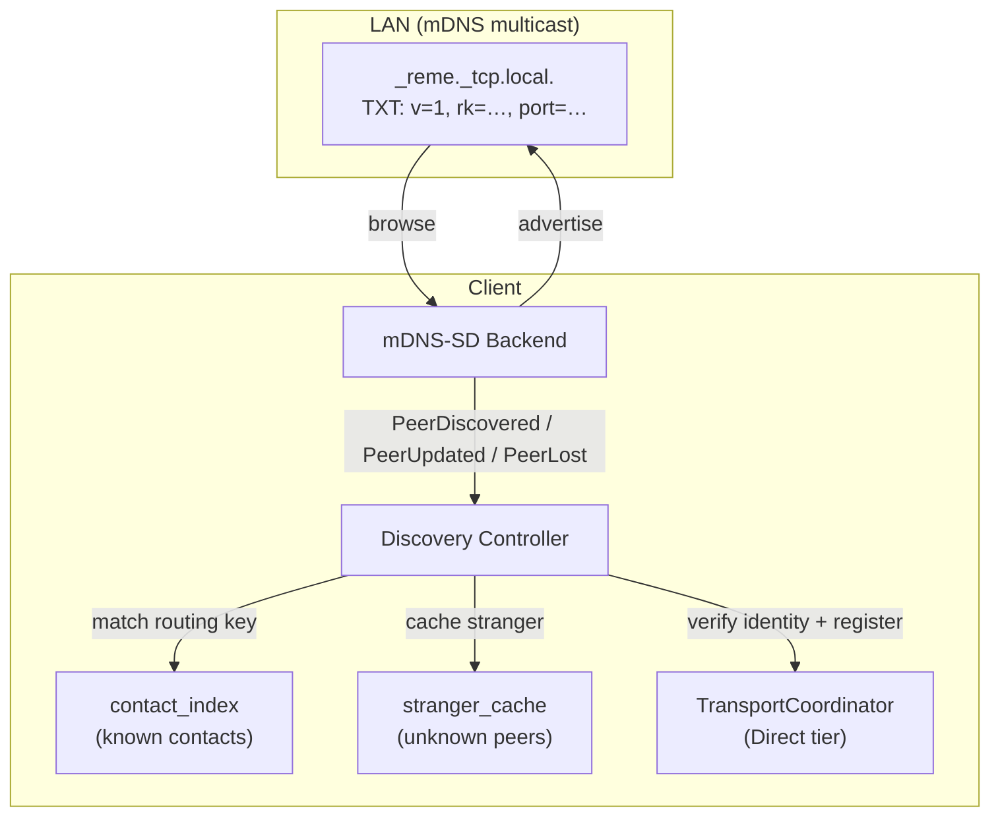
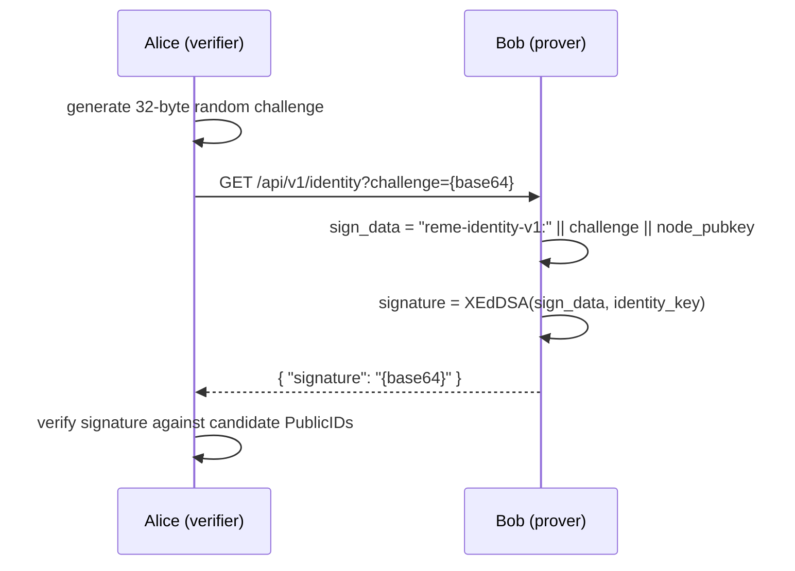
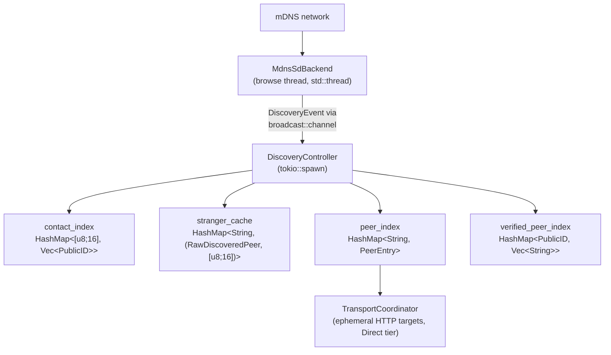

# LAN Discovery

Automatic peer discovery and verified P2P messaging on local networks using mDNS/DNS-SD.

## Overview

When two reme clients are on the same LAN, they can discover each other automatically and exchange messages directly —
no mailbox node required. The discovery system uses mDNS (multicast DNS) to advertise presence and DNS-SD (Service
Discovery) to find peers. Before a discovered peer is used for message delivery, its identity is verified via a
cryptographic challenge-response protocol.



## Operating modes

LAN discovery has two modes controlled by the `auto_direct_known_contacts` configuration option.

### Full mode (default): `auto_direct_known_contacts = true`

Both advertising and browsing are active. The client:

1. **Advertises** its own presence via mDNS (if embedded HTTP server is enabled)
2. **Browses** for other `_reme._tcp.local.` services on the LAN
3. **Matches** discovered peers against the contact list by routing key
4. **Verifies** identity of matched peers via challenge-response
5. **Registers** verified peers as ephemeral Direct-tier transport targets
6. **Caches** unmatched peers (strangers) for later matching when new contacts are added
7. **Refreshes** all tracked peers periodically (concurrent re-verification)

This is zero-configuration P2P messaging: add a contact, and if they're on the same LAN, messages flow directly.

### Advertise-only mode: `auto_direct_known_contacts = false`

Only advertising is active. The client:

1. **Advertises** its own presence via mDNS (if embedded HTTP server is enabled)
2. **Does not browse** — no peer discovery, no verification, no target registration

This mode is useful when you want to be discoverable by other peers but don't want to discover them yourself. For
example, a device acting as a passive relay that accepts inbound messages but never initiates direct delivery.

**Important:** Browsing is triggered lazily by `subscribe()`. When `auto_direct_known_contacts = false`, no subscription
is created, so the mDNS daemon never starts browsing — even though `lan_discovery.enabled = true`. This is intentional:
browsing without processing discoveries would be wasteful.

## mDNS advertisement

### Service type

All reme clients advertise as `_reme._tcp.local.` services.

### Instance name

The mDNS instance name is derived from the client's routing key:

```
reme-{hex(routing_key)}
```

For example: `reme-deadbeef0123456789abcdeffedcba98`

This is 37 characters — within the 63-byte DNS label limit. The routing key is already broadcast in the TXT records, so
the instance name leaks no additional information beyond what's already public. Using the routing key instead of the
machine hostname prevents leaking the device name or PID to LAN observers.

### Host FQDN

Similarly derived: `reme-{hex(routing_key)}.local.`

### TXT records

| Key    | Value                           | Description                          |
|--------|---------------------------------|--------------------------------------|
| `v`    | `1`                             | Protocol version                     |
| `rk`   | Hex-encoded 16-byte routing key | Truncated BLAKE3 hash of PublicID    |
| `port` | Decimal port number             | Redundant with SRV; SRV is preferred |

### Advertising prerequisites

Advertising only starts when both conditions are met:

- `embedded_node.enabled = true`
- `embedded_node.http_bind` is configured

Without an HTTP server listening, advertising would direct peers to a dead endpoint.

## Peer discovery flow

### 1. mDNS event

The mDNS-SD backend emits three event types:

- **`PeerDiscovered`** — a new service appeared (first resolution)
- **`PeerUpdated`** — an existing service's records changed (re-resolution)
- **`PeerLost`** — a service was removed (TTL expiry or goodbye packet)

`PeerDiscovered` is effectively one-shot per session: the mDNS daemon caches resolved services and won't re-announce
them until the TTL expires (75 minutes at default 4500s TTL).

### 2. Contact matching

The controller decodes the peer's TXT records and extracts its routing key. It then checks `contact_index` — a map of
known contact routing keys to their PublicID(s).

- **Match found:** proceed to identity verification
- **No match (stranger):** cache in `stranger_cache` for later (see [Stranger cache](#stranger-cache))

### 3. Identity verification

Before registering a peer as a transport target, the controller verifies that the peer actually controls the claimed
identity via a challenge-response protocol:



1. Alice generates a 32-byte random challenge
2. Alice sends `GET /api/v1/identity?challenge={base64}` to Bob's advertised address
3. Bob signs `"reme-identity-v1:" || challenge || node_pubkey` using XEdDSA with his identity key
4. Alice verifies the signature against each candidate PublicID for the routing key
5. If any candidate matches, the peer is verified

**Timing protection:** The verification loop iterates ALL candidate public keys regardless of early match, preventing
timing-based leakage of which identity was matched or how many candidates exist.

**Response limits:** Responses are streamed incrementally with a 4 KiB cap to prevent memory exhaustion from malicious
peers.

### 4. Target registration

Verified peers are registered as ephemeral HTTP targets in the `TransportCoordinator` with `DeliveryTier::Direct`.
Direct-tier targets are raced first during message delivery — if any succeeds, the message is considered delivered
without waiting for quorum.

Ephemeral targets are **send-only** (no fetch capability) to prevent routing key leakage via polling. See
the [Security](#security) section for details.

## Stranger cache

mDNS `PeerDiscovered` events are one-shot. If a peer is discovered before being added as a contact, it would be
permanently missed until the mDNS cache expires or the peer restarts.

The stranger cache solves this: when a discovered peer's routing key doesn't match any contact, it's stored in
`stranger_cache` (keyed by instance name, with the pre-decoded routing key). When a new contact is added at runtime, the
cache is scanned for matching routing keys. Matches are removed from the cache and fed through the standard identity
verification flow.

- **Size cap:** bounded by `max_peers` (default 256)
- **Updates:** already-cached strangers are updated on `PeerUpdated` even when the cache is full
- **Cleanup:** entries are removed on `PeerLost` events and on controller shutdown
- **Failed re-processing:** strangers that fail verification after contact-add are silently dropped (not re-cached);
  they'll be caught on the next mDNS re-announcement

## Periodic refresh

Every `refresh_interval_secs` seconds (default: 300), the controller re-verifies all tracked peers concurrently using
`JoinSet`. Each verification runs as an independent tokio task sharing the `reqwest::Client` connection pool. With
`max_peers = 256` and a 5-second HTTP timeout, worst-case refresh completes in ~5 seconds instead of ~21 minutes
sequentially.

### Circuit breaker

Peers that fail verification are tracked with a consecutive failure counter. After `FAILURE_THRESHOLD` (2) consecutive
failures, the peer is removed from all indices and its transport target is deregistered.

On successful verification, the failure counter is reset to zero.

## Configuration

```toml
[lan_discovery]
# Enable mDNS advertisement and (optionally) browsing.
# Default: false
enabled = true

# When true (default): browse for peers, verify identity, register as
# Direct-tier targets. When false: advertise-only mode — no browsing,
# no peer verification, no target registration.
auto_direct_known_contacts = true

# Maximum number of tracked peers (verified + stranger cache).
# Default: 256
max_peers = 256

# Seconds between periodic re-verification of tracked peers.
# Clamped to a minimum of 30. Default: 300.
refresh_interval_secs = 300
```

### Interaction with embedded node

LAN discovery requires the embedded node's HTTP server for two purposes:

1. **Advertising:** the advertised port is the embedded node's HTTP bind port
2. **Inbound messages:** discovered peers send messages to the embedded node's `/api/v1/submit` endpoint

```toml
[embedded_node]
enabled = true
http_bind = "0.0.0.0:23004"
```

Without `embedded_node.enabled = true` and a configured `http_bind`, the client will browse for peers (if
`auto_direct_known_contacts = true`) but will not advertise itself.

## Security

### Identity verification prevents impersonation

An attacker advertising a victim's routing key via mDNS will fail the challenge-response verification — they cannot
produce a valid XEdDSA signature without the victim's private key. The peer is silently ignored.

### Ephemeral targets are send-only

Discovered peers default to `TargetCapabilities { send: true, fetch: false }`. The client never polls discovered peers
for messages, preventing routing key leakage via fetch requests. Message fetching happens exclusively from trusted
stable mailbox nodes.

### Routing key presence confirmation

An observer on the LAN can see routing keys in mDNS TXT records. Since `routing_key = BLAKE3(PublicID)[..16]`, an
attacker who knows a target's PublicID can confirm their presence on the network by computing the hash and checking for
a match. This is inherent to the mDNS discovery model — advertising presence necessarily reveals some identity
information.

### Instance name cross-session tracking

The instance name `reme-{hex(routing_key)}` is stable across restarts (same identity = same name). A passive LAN
observer can correlate advertisements across sessions and networks. This is a known trade-off — the routing key is
already in the TXT records, so the instance name adds no new information, but the stable name makes correlation trivial
rather than requiring TXT parsing.

### Known gaps

- **Channel binding (SEC-M2, #116):** The responder's IP:port is not included in the signed challenge data. A LAN
  attacker could relay the challenge to a legitimate node and forward the signed response back, performing a MITM.
  Mitigated by E2E encryption (the attacker can't decrypt messages) but enables message blackholing if combined with
  receipt-gating gaps.

- **Receipt-gated direct tier (#90):** Currently, any HTTP 2xx response from a Direct-tier target is considered success.
  A relay attacker who passes identity verification can silently drop messages by returning 200 OK with an empty
  receipt.

For the full threat analysis, see [threat-model.md](threat-model.md).

## Architecture

### Crate structure

```
crates/reme-discovery/
├── backend.rs       # DiscoveryBackend trait (start_advertising, subscribe, shutdown)
├── types.rs         # RawDiscoveredPeer, DiscoveryEvent, AdvertisementSpec
├── txt.rs           # TXT record encode/decode (v, rk, port)
├── mdns_sd.rs       # MdnsSdBackend — production implementation using mdns-sd crate
└── fake.rs          # FakeBackend — test double for unit tests

apps/client/src/discovery/
├── mod.rs           # initialize() — creates backend, spawns controller, starts advertising
└── controller.rs    # DiscoveryController — event loop, verification, target management
```

### Key types

| Type                  | Location         | Purpose                                                           |
|-----------------------|------------------|-------------------------------------------------------------------|
| `DiscoveryBackend`    | `reme-discovery` | Trait for pluggable backends (mDNS, BLE future)                   |
| `MdnsSdBackend`       | `reme-discovery` | Production mDNS implementation                                    |
| `RawDiscoveredPeer`   | `reme-discovery` | Instance name, addresses, port, TXT records                       |
| `DiscoveryEvent`      | `reme-discovery` | PeerDiscovered / PeerUpdated / PeerLost                           |
| `AdvertisementSpec`   | `reme-discovery` | Service type, port, TXT records, routing key                      |
| `DiscoveryController` | `client`         | Event loop with contact matching, verification, target management |
| `SpawnConfig`         | `client`         | Controller initialization parameters                              |

### Data flow


