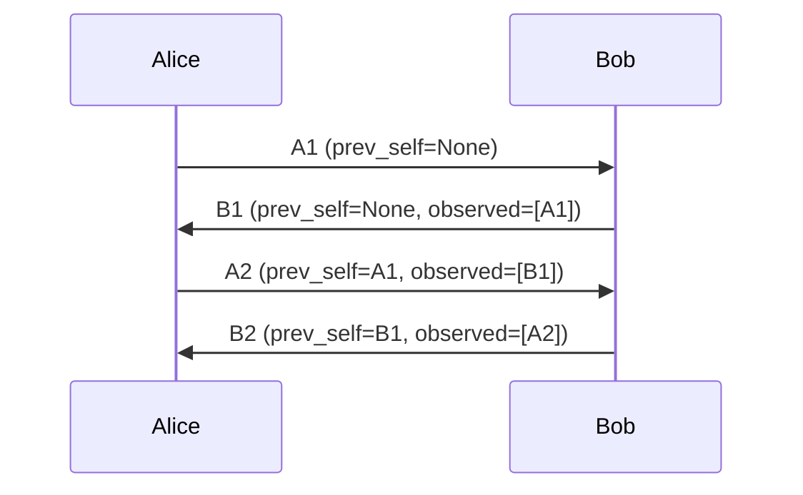
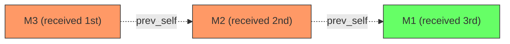
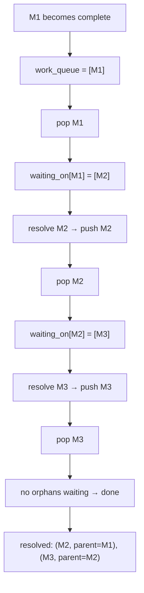
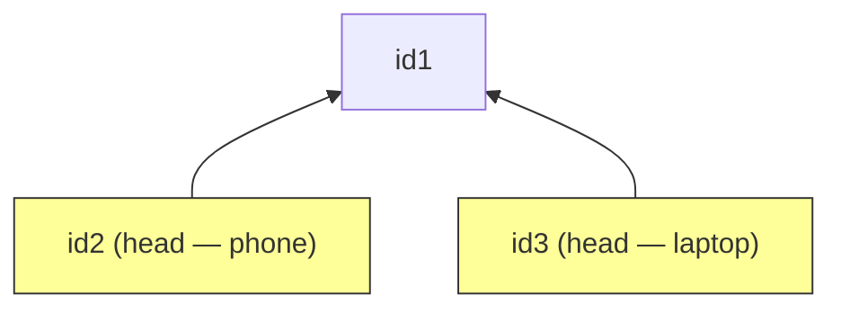
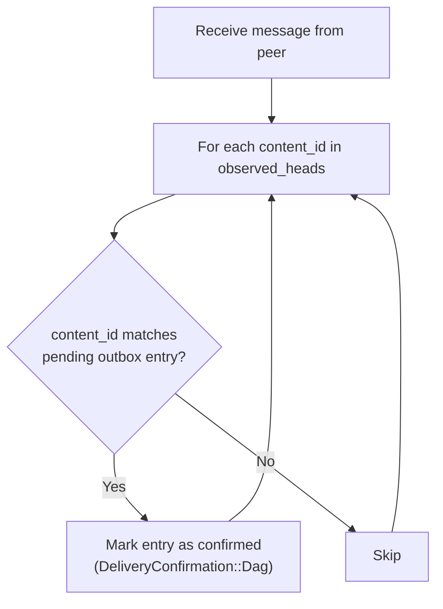
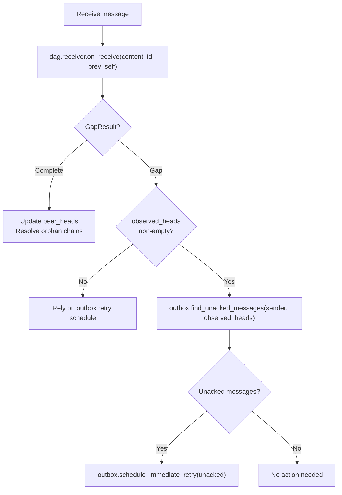
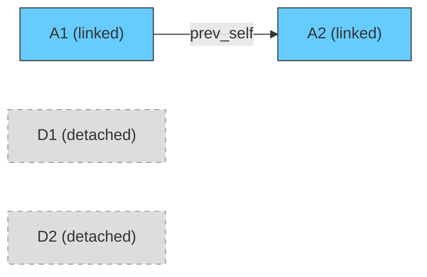

# Merkle DAG: Message Ordering and Gap Detection

This document describes how the Resilient Messenger uses a Merkle DAG (Directed Acyclic Graph) to establish causal ordering between messages, detect missing messages, and trigger automatic resends — all without a central sequencer or reliable transport.

## Overview

Every linked message carries two DAG references embedded in the `InnerEnvelope`:

| Field | Type | Purpose |
|---|---|---|
| `prev_self` | `Option<ContentId>` | Sender's own previous message (per-sender chain) |
| `observed_heads` | `Vec<ContentId>` | Latest message(s) seen from the peer |
| `epoch` | `u16` | Conversation epoch (increments on history clear) |
| `flags` | `u8` | Bit flags, including `FLAG_DETACHED` (`0x01`) |

Together, `prev_self` forms a singly-linked chain per sender direction, while `observed_heads` creates cross-links that enable implicit acknowledgments:



This structure gives both parties enough information to:

1. **Order messages** within each sender's chain via `prev_self`.
2. **Detect missing messages** when a `prev_self` references an unknown `ContentId`.
3. **Confirm delivery** when a peer's `observed_heads` includes our sent message.
4. **Trigger resends** when gaps are detected or messages remain unacknowledged.

## ContentId: Content-Addressed Message Identity

Each message gets a deterministic 8-byte identifier computed as a truncated BLAKE3 hash:

```text
ContentId = BLAKE3(
    "reme-content-id-v1"
    || InnerEnvelope.from.to_bytes()          // PublicID as 32 raw bytes
    || InnerEnvelope.created_at_ms.to_le()    // u64 little-endian
    || postcard::to_allocvec(content)          // postcard-serialized Content
)[0..8]
```

Key design choices:

- **DAG fields are excluded from the hash.** The same message content resent with different `prev_self` / `observed_heads` produces the same `ContentId`. This allows retransmission without changing the identity.
- **8 bytes (64 bits)** provides a birthday bound of ~4 billion messages per conversation — more than sufficient for any realistic use.
- **BLAKE3's XOF design** makes truncation safe and expected.

## Gap Detection

The system uses a dual-detector architecture — one for each direction of the conversation.

### Receiver Gap Detector

Tracks incoming messages and detects when a `prev_self` reference points to a message we haven't received yet.

When a message arrives:

1. If `prev_self = None` → mark **complete** (first message or detached).
2. If `prev_self` points to a known complete message → mark **complete**.
3. If `prev_self` points to an unknown message → mark as **orphan** and record the gap.



> **M3** and **M2** arrive as orphans. When **M1** arrives, the resolution chain fires: M1 complete → M2 resolves → M3 resolves.

Orphan resolution uses an iterative work queue with a `waiting_on` index for O(1) lookups, avoiding stack overflow on long chains. When a message becomes complete, all orphans waiting on it are resolved transitively:



The `missing_parents()` method returns the set of unknown parent `ContentId`s — suitable for requesting retransmission from the sender.

There is also a `mark_complete()` escape hatch for messages received through alternative means (e.g., out-of-band resync) where the full parent chain is not available.

### Sender Gap Detector

Tracks our own sent messages and determines what the peer is missing.

When we send a message, `on_send(content_id, prev_self)` records it and maintains the set of **heads** (leaf nodes of our sent chain). When a peer's `observed_heads` arrives, `find_missing(peer_observed)` computes the difference:

1. Walk backward from each `peer_observed` ID through the `prev_self` chain, collecting all ancestors.
2. Return every sent message NOT in that ancestor set.

This correctly handles **multi-head forks** (from multi-device or concurrent sends):



| Peer observed | Missing | Reason |
|---|---|---|
| `[id1]` | `[id2, id3]` | Both branches unseen |
| `[id2]` | `[id3]` | id1 implied via ancestry of id2 |
| `[id2, id3]` | `[]` | Fully caught up |

## Peer Head Tracking

The `ConversationDag` maintains a `peer_heads: HashSet<ContentId>` set that tracks the peer's current leaf nodes. This set becomes the `observed_heads` vector in our next outgoing message.

**Update rules:**

- When a **complete** (non-orphan) message arrives: remove parent from `peer_heads`, add message.
- When **orphans resolve**: update `peer_heads` for each resolved orphan in chain order.
- Orphan messages are **never** added to `peer_heads` — advertising them would falsely tell the peer we have their ancestors when we don't.
- Multi-device peers naturally produce multiple heads (e.g., phone and laptop each send independently).

## Implicit ACK via observed_heads

The `observed_heads` field doubles as a delivery confirmation mechanism. When Bob sends a message with `observed_heads = [A2]`, Alice knows Bob received message A2 (and, by transitivity, all of A2's ancestors).

On the receiving side, `Client::process_message()` feeds the peer's `observed_heads` into the outbox:



This eliminates the need for explicit ACK messages — the DAG structure provides piggybacked confirmation on every message the peer sends.

## Automatic Resend Triggering

When the receiver detects gaps (orphan messages), the client also checks for unacknowledged outbox entries and schedules immediate retries.

**Important caveat:** both implicit ACK confirmation and resend triggering are gated on `observed_heads` being non-empty. Messages with empty `observed_heads` (detached messages, or the peer's very first message) will not trigger this path. Gap recovery for those cases relies solely on the outbox's own retry schedule.



The reasoning: if the peer's message creates a gap in our view, it's likely that our messages also have gaps in the peer's view. By proactively retrying unacknowledged messages, both sides converge faster.

The outbox integrates tightly with this mechanism:

- **`find_unacked_messages(recipient, peer_observed_heads)`** — Returns pending entries whose `content_id` is NOT in the peer's observed set.
- **`schedule_immediate_retry(entry_ids)`** — Sets `next_retry_at` to now, causing the urgent-phase background task to pick them up immediately.

This is complementary to the outbox's own three-phase retry mechanism (see [tiered-delivery.md](tiered-delivery.md)):

| Phase | Behavior | DAG Interaction |
|---|---|---|
| **Phase 1 (Urgent)** | Aggressive retry with exponential backoff | Gap detection can schedule immediate retries into this phase |
| **Phase 2 (Distributed)** | Periodic maintenance refresh (every 4h) | Continues until DAG confirmation or tombstone |
| **Phase 3 (Confirmed)** | Cleanup after delay | Entered when `observed_heads` confirms delivery |

## State Anomaly Detection

Beyond gap detection, the DAG enables two important anomaly signals exposed on every `ReceivedMessage`:

### Sender State Reset

Detected when:
- We have prior history from the sender (`peer_heads` is non-empty), AND
- The incoming message has `prev_self = None`, AND
- The message is NOT flagged as detached (`FLAG_DETACHED`), AND
- The sender's epoch has NOT advanced.

This indicates the sender likely lost their DAG state (reinstall, data loss) and is starting a fresh chain without an intentional history clear. The application layer can use this signal to display a warning or re-send important messages.

### Local State Behind

Detected when:
- The sender's `observed_heads` contains `ContentId`s that our `SenderGapDetector` doesn't recognize.

This means the peer has seen messages from us that we have no record of sending — indicating we lost state. The application layer can surface this to the user.

## Epochs: Intentional History Clears

The `epoch` field (`u16`, 65,536 distinct values 0..=65,535) allows cleanly breaking the DAG when history is intentionally deleted.

### Local Clear

`clear_conversation_dag()` increments the epoch and resets all DAG state:
- Receiver gap detector cleared (complete + orphan sets).
- Sender gap detector cleared (sent chain + heads).
- `peer_heads` cleared.
- New epoch persisted to storage.

The next message sent will have `prev_self = None` at the new epoch — the peer recognizes this as intentional because the epoch advanced.

### Receiving Epoch Advance

When a message arrives with `epoch > dag.epoch`:
- Call `advance_to_peer_epoch(new_epoch)`.
- Resets receiver state and `peer_heads`.
- Does NOT affect sender state (we still know what we sent).

After an epoch advance, messages referencing pre-epoch `ContentId`s via `prev_self` will produce gaps. This is expected — those messages belong to the old epoch and should not be retroactively linked.

## Detached Messages (FLAG_DETACHED)

Constrained transports (LoRa, BLE) cannot afford the bandwidth overhead of DAG fields. Detached messages set `FLAG_DETACHED` and send:

- `prev_self = None`
- `observed_heads = []`
- `flags |= 0x01`

**Behavior:**
- Always treated as **complete** by the receiver (no gap detection attempted).
- Do NOT update the sender's chain (`on_send` is skipped).
- Do NOT falsely trigger the "sender state reset" anomaly — the explicit flag distinguishes intentional detachment from state loss.
- Can be retroactively linked into the DAG when a subsequent linked message references them.

Detached messages can be interleaved freely with linked messages without disrupting the DAG:



> A2 links to A1, skipping over the detached messages D1 and D2. All four messages are **complete** from the receiver's perspective.

## Persistence

DAG state is persisted per-contact in SQLite:

```sql
CREATE TABLE dag_state (
    contact_pubkey  BLOB PRIMARY KEY NOT NULL,
    epoch           INTEGER NOT NULL DEFAULT 0,
    sender_head     BLOB,            -- 8 bytes (ContentId) or NULL
    peer_heads      BLOB             -- concatenated 8-byte ContentIds
);
```

### What Is Persisted

| Field | Purpose |
|---|---|
| `epoch` | Conversation epoch — prevents epoch regression on restart |
| `sender_head` | Our last sent `ContentId` — becomes `prev_self` in next message |
| `peer_heads` | Peer's leaf nodes — becomes `observed_heads` in next message |

### What Is NOT Persisted

- **Full sender chain**: Only the head is stored. The full `sent` map in `SenderGapDetector` is not restored. On restart, `find_missing()` will be less precise until the in-memory state rebuilds from new sends.
- **Receiver gap detector**: Complete set and orphan tracking are not restored. After restart, the detector starts empty — previously received messages are simply unknown, so re-delivered messages are processed without prior gap context. This avoids expensive state reconstruction and is acceptable because relay nodes expire messages via TTL anyway.

### Persistence Strategy

Persistence is best-effort: failures are logged as warnings rather than propagated as errors. DAG persistence is an optimization (avoids false `prev_self = None` after restart) not a correctness requirement — the worst case is a benign sender-state-reset signal that resolves after one round-trip.

The `persist_dag_state()` method is called outside the DAG mutex to avoid holding the lock across SQLite I/O. Fields are extracted while holding the lock, then the lock is dropped before writing.

## Multi-Head Support

Both `SenderGapDetector.heads` and `ConversationDag.peer_heads` are `HashSet<ContentId>`, supporting multiple simultaneous leaf nodes. This handles:

- **Multi-device**: Alice sends from phone (A2) and laptop (A3), both linking to A1 → two heads.
- **Concurrent sends**: Race condition produces parallel branches.
- **Fork resolution**: A subsequent message that links to one head naturally reduces the head count.

When constructing `observed_heads`, all peer heads are included. The peer can then compute exactly which messages we've seen across all branches.

## Current Gaps and Future Work

### No Explicit Resend Request Protocol

Currently, the receiver detects gaps (missing parents) and the system reacts by retrying our own unacknowledged messages. However, there is no wire protocol for the receiver to explicitly request "please resend ContentId X" from the sender. This means:

- Gap recovery relies on the sender still having the message in their outbox.
- If the outbox entry has expired or been cleaned up, the gap cannot be filled.
- A future `Content::ResendRequest(Vec<ContentId>)` message type could close this gap.

### No Orphan Expiry

Orphans in the `ReceiverGapDetector` accumulate indefinitely in-memory (though they are cleared on restart since receiver state is not persisted). A TTL-based eviction policy could prevent unbounded growth during prolonged partitions.

### Receiver State Not Persisted

The `ReceiverGapDetector` is not persisted across restarts. This means:

- Messages received before restart lose their "complete" status in the gap detector.
- If the same messages are re-delivered after restart, they are re-processed without gap context.
- This is acceptable because relay nodes have TTLs and will not re-deliver expired messages.

### ContentId Collision Bound

At 8 bytes, the birthday bound is ~4 billion messages per conversation. While sufficient for any realistic use, a future extension could use variable-length `ContentId`s for high-volume relay scenarios.

### Epoch Overflow

The `epoch` field uses wrapping addition (`wrapping_add`). A `u16` supports 65,536 distinct epoch values (0–65,535), so after 65,535 increments the next one wraps to 0 and previously used epoch values begin to repeat. Wrapping is handled gracefully but could theoretically cause confusion if both peers are at distant epoch values.
