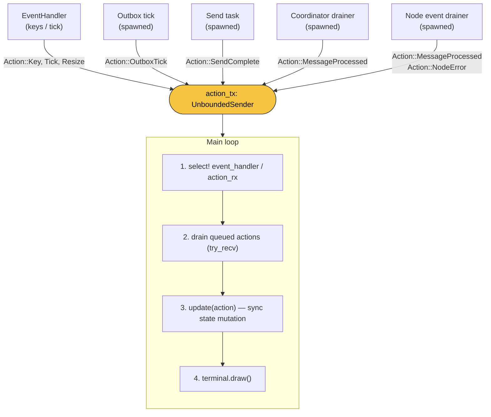
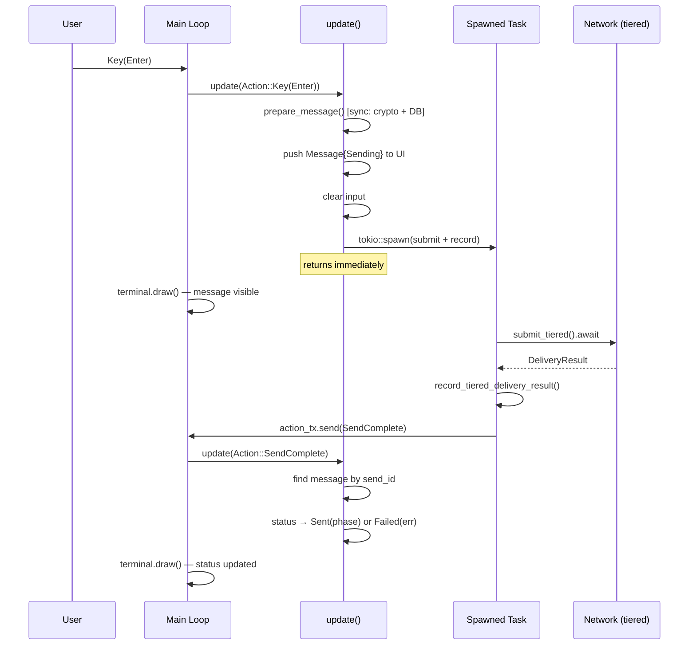

# Action-Based TUI Event Loop

**Date:** 2026-03-27
**Issue:** #99 (`send_text_tiered` blocks TUI event loop)
**Also fixes:** #97 (tombstone send blocks TUI rendering)
**Status:** Design

---

## Problem

The TUI main loop (`App::run`) calls async methods inline in event handlers. Any method that performs network I/O blocks rendering and input until it completes. Three call sites currently block:

| Call site                                         | Method                      | Network I/O                                                             | Worst-case latency                     |
|---------------------------------------------------|-----------------------------|-------------------------------------------------------------------------|----------------------------------------|
| `handle_input_key` (line 1268)                    | `client.send_text_tiered()` | `submit_tiered()` races ephemeral targets, broadcasts to quorum targets | 2s per unreachable target, accumulates |
| `process_incoming_envelope` (line 997)            | `client.process_message()`  | `transport.submit_ack_tombstone()` (fire-and-forget)                    | 2-5s on timeout                        |
| `handle_add_upstream_popup_key_event` (line 1607) | `MqttTarget::connect()`     | TCP + MQTT handshake                                                    | 10s on timeout                         |

The root cause is structural: the event loop is a single `while self.running` loop where event handling, I/O, and rendering are interleaved. Any `.await` on network I/O freezes everything.

## Design

### Architecture: Action enum as single integration point

Adopt the standard ratatui async pattern (used by `television`, `systemctl-tui`, `viddy`, and the official ratatui async template): a typed `Action` enum funneled through an unbounded channel. All I/O runs in spawned tasks that send results back as `Action` variants.

**Key invariant:** The `update()` method that processes actions is synchronous. It cannot `.await`, so it is structurally impossible for action handling to block the render loop.



### Action enum

```rust
/// All events that can affect application state.
///
/// This is the single integration point for the TUI. Background tasks,
/// UI events, and spawned I/O all communicate through this type.
pub enum Action {
    // === UI events (from EventHandler) ===
    Key(KeyEvent),
    Tick,
    Resize(u16, u16),

    // === Send results (from spawned send tasks) ===
    SendComplete {
        send_id: u64,
        result: Result<TieredDeliveryPhase, String>,
    },

    // === Incoming messages (from background drainer tasks) ===
    MessageProcessed {
        result: Result<ReceivedMessage, String>,
        source: MessageSource,
    },

    // === Outbox tick (from spawned periodic task) ===
    OutboxTick(Result<(usize, usize, u64), String>),

    // === Node events (from background drainer task) ===
    NodeError(String),

    // === Upstream add (from spawned connection task) ===
    UpstreamAdded {
        url: String,
        transport_type: UpstreamType,
        result: Result<(), String>,
    },
}

#[derive(Debug, Clone, Copy)]
pub enum MessageSource {
    Coordinator,
    EmbeddedNode,
}
```

### DeliveryStatus on Message struct

```rust
/// A message in the conversation (TUI-only, not a wire type).
#[derive(Debug, Clone)]
pub struct Message {
    pub from_me: bool,
    pub sender_name: String,
    pub content: String,
    pub timestamp: String,
    pub status: DeliveryStatus,
}

/// Delivery status for sent messages. Displayed as a visual indicator.
#[derive(Debug, Clone, Default)]
pub enum DeliveryStatus {
    #[default]
    None,             // Received messages or messages loaded from history
    Sending,          // Optimistic display, send task in flight
    Sent(String),     // Delivery succeeded, carries phase description
    Failed(String),   // All tiers failed, carries error
}
```

### Main loop

```rust
pub async fn run(&mut self, terminal: &mut Terminal<impl Backend>) -> AppResult<()> {
    let mut event_handler = EventHandler::new(100);
    self.spawn_background_tasks();

    while self.running {
        // Wait for next event or action (whichever comes first)
        tokio::select! {
            event = event_handler.next() => {
                let action = match event? {
                    Event::Key(k) => Action::Key(k),
                    Event::Tick => Action::Tick,
                    Event::Resize(w, h) => Action::Resize(w, h),
                };
                self.update(action);
            }
            Some(action) = self.action_rx.recv() => {
                self.update(action);
            }
        }

        // Drain any additional queued actions (non-blocking)
        while let Ok(action) = self.action_rx.try_recv() {
            self.update(action);
        }

        // Render after processing all pending state changes
        terminal.draw(|frame| ui::render(frame, self))?;
    }

    self.shutdown().await;
    Ok(())
}
```

### update() — sync action handler

`update(&mut self, action: Action)` is a non-async method. It pattern-matches on `Action` and performs only:
- State mutations (field assignments, vec pushes)
- Synchronous local operations (crypto, SQLite reads/writes)
- `tokio::spawn` to kick off I/O, passing `self.action_tx.clone()`

It never `.await`s.

### Send flow (fix for #99)



1. `Action::Key(Enter)` arrives while `focus == Input`.
2. `update()` handles it:
   a. Extract text from input, validate non-empty.
   b. Call `client.prepare_message()` (sync: crypto + outbox DB insert). This returns the prepared envelope and entry ID.
   c. Assign a monotonic `send_id` (from `App::next_send_id` counter).
   d. Create `Message { status: DeliveryStatus::Sending, .. }`, push to messages, cache it.
   e. Clear input field.
   f. Spawn:
      ```rust
      let client = self.client.clone();
      let tx = self.action_tx.clone();
      tokio::spawn(async move {
          let result = client.transport
              .submit_tiered(&envelope, &client.tiered_config)
              .await;
          let phase = client.outbox
              .record_tiered_delivery_result(entry_id, &result, &client.tiered_config);
          let _ = tx.send(Action::SendComplete { send_id, result: /* phase or error */ });
      });
      ```
3. `Action::SendComplete { send_id, result }` arrives later.
4. `update()` finds the message by `send_id`, updates status to `Sent(phase)` or `Failed(error)`.

**Note:** `prepare_message` is currently private on `Client`. The implementation will expose the prepare/submit split: make `PreparedMessage` and `prepare_message` public, and add a public `submit_prepared_tiered(&self, prepared: &PreparedMessage) -> impl Future` that wraps `submit_tiered` + `record_tiered_delivery_result`. This maps naturally to the sync-then-spawn pattern without leaking transport internals.

### Incoming message flow (fix for #97)

Background drainer task (spawned once at startup):

```rust
let client = self.client.clone();
let tx = self.action_tx.clone();
tokio::spawn(async move {
    while let Some(event) = coordinator_events.recv().await {
        if let TransportEvent::Message(envelope) = event {
            let result = client.process_message(&envelope).await;
            let _ = tx.send(Action::MessageProcessed {
                result: result.map_err(|e| e.to_string()),
                source: MessageSource::Coordinator,
            });
        }
    }
});
```

Same pattern for `node_event_rx`. The tombstone send inside `process_message` now runs in the background task — it can take as long as it needs without affecting the UI.

`update()` handles `Action::MessageProcessed` by extracting content, updating conversations, and showing the message. All sync operations.

### Upstream add flow

When the user confirms an upstream URL in the popup:

1. `update()` extracts the URL and transport type from the popup state.
2. For HTTP: `HttpTarget::new()` is sync — create it inline, add to coordinator, send success.
3. For MQTT: `MqttTarget::connect()` is async — spawn it:
   ```rust
   tokio::spawn(async move {
       let result = MqttTarget::connect(config).await;
       // ... register in coordinator ...
       let _ = tx.send(Action::UpstreamAdded { url, transport_type, result });
   });
   ```
4. Show "Connecting..." status while waiting.
5. `Action::UpstreamAdded` closes the popup and shows result.

### Outbox tick flow

No structural change — already runs in a spawned task. The only difference is the result now goes through `action_tx` instead of a dedicated channel:

```rust
tokio::spawn(async move {
    let mut interval = tokio::time::interval(outbox_interval);
    interval.tick().await;
    loop {
        interval.tick().await;
        let result = client.tiered_outbox_tick().await;
        if tx.send(Action::OutboxTick(result.map_err(|e| e.to_string()))).is_err() {
            break;
        }
    }
});
```

This eliminates the dedicated `outbox_result_rx` channel — all results flow through the unified `action_rx`.

### UI rendering of DeliveryStatus

In `ui.rs`, after rendering the message content line, append a status indicator for sent messages:

| Status          | Display                                                    |
|-----------------|------------------------------------------------------------|
| `None`          | (nothing)                                                  |
| `Sending`       | dim italic "sending..."                                    |
| `Sent(phase)`   | dim checkmark + phase text (e.g., "Direct" / "Quorum 2/3") |
| `Failed(error)` | red "! Failed: {error}"                                    |

Only shown for `from_me == true` messages. Rendering is a few extra `Span`s — no structural UI changes.

### App struct changes

```rust
pub struct App<'a> {
    // ... existing fields ...

    /// Action sender — cloned into background tasks for result delivery.
    action_tx: mpsc::UnboundedSender<Action>,
    /// Action receiver — drained in the main loop.
    action_rx: mpsc::UnboundedReceiver<Action>,
    /// Monotonic counter for correlating send results to optimistic messages.
    next_send_id: u64,

    // REMOVED (moved to background drainer tasks):
    // coordinator_events: mpsc::UnboundedReceiver<TransportEvent>,
    // node_event_rx: Option<mpsc::Receiver<NodeEvent>>,
}
```

`coordinator_events` and `node_event_rx` are consumed by the background drainer tasks at startup and no longer stored on `App`.

### Concurrency note: `Arc<Client>` and spawned tasks

`Client` is already `Arc`-wrapped. Spawned tasks clone the `Arc` and call methods on it. `prepare_message` takes `&self` and uses `&self.storage` (SQLite, which is `Send + Sync`). `submit_tiered` takes `&self` on the coordinator. No new `Mutex` or `RwLock` is needed — the existing design supports concurrent reads.

`ClientOutbox` uses `&self` with interior mutability handled by the SQLite storage backend (documented in `reme-outbox/src/lib.rs:65`). SQLite serializes writes internally. Multiple spawned tasks calling outbox methods concurrently is safe.

---

## Scope

### In scope

- Refactor `App::run` main loop to `tokio::select!` + `Action` enum
- Make `update()` synchronous (no `.await`)
- Move `send_text_tiered` to spawned task with optimistic display
- Move `process_message` to background drainer task
- Move `MqttTarget::connect` to spawned task
- Unify outbox tick results through `action_tx`
- Add `DeliveryStatus` to TUI `Message` struct
- Render delivery status indicators in `ui.rs`
- Expose prepare/submit split on `Client` (or equivalent) so the TUI can do sync prep + async spawn

### Out of scope

- Changes to `reme-core` wire types or storage format
- Refactoring `process_message` to separate crypto from tombstone (cleaner but unnecessary — spawning the whole thing works)
- Component trait system (the ratatui template's `Component` trait is useful for multi-view apps but overkill for reme's single-view TUI)
- Separate render task (television's pattern — adds complexity; rendering is fast since it's just text)

---

## Testing

- **Manual:** Send a message while multiple unreachable ephemeral targets are configured. Verify:
  - Message appears immediately with "sending..." indicator
  - TUI remains responsive (can scroll, switch conversations, type)
  - Status updates to sent/failed when delivery completes
- **Regression:** All existing key handlers work unchanged
- **Edge cases:**
  - Rapid sends: multiple in-flight sends don't interfere with each other
  - Send while receiving: incoming message doesn't clobber in-flight send status
  - App quit during in-flight send: graceful shutdown, no panic

---

## Migration path

This is a refactor of `apps/client/src/tui/app.rs` (and minor changes to `ui.rs`). No changes to wire format, storage, or public APIs of library crates. The `reme-core` change is exposing the prepare/submit split — additive, not breaking.

Estimated files changed:
- `apps/client/src/tui/app.rs` — major refactor (main loop, action enum, update function, spawn background tasks)
- `apps/client/src/tui/ui.rs` — add delivery status rendering
- `crates/reme-core/src/lib.rs` — expose prepare/submit split (make `PreparedMessage` public, add public submit method)
